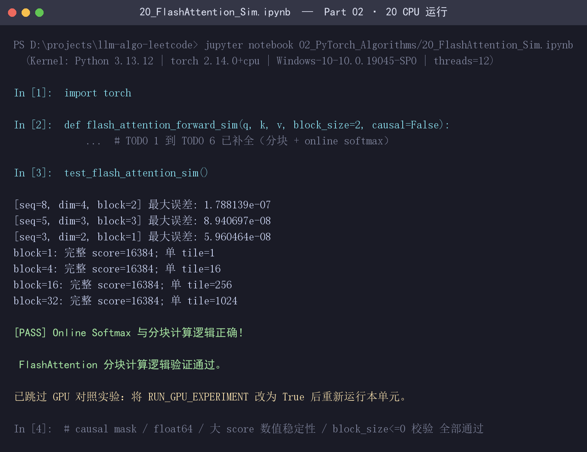

# Task1 · Prefill 与 Attention Kernel 学习笔记

> 对应共学任务：[#147 llm-algo-leetcode 推理优化 | 202609 Task1 · Prefill 与 Attention Kernel](https://github.com/datawhalechina/llm-algo-leetcode/issues/147)
> 打卡路线：4.1 + 4.2 + 4.3（全写）
> 学习顺序：GPU 约束 → 访存与 Tiling → Prefill

## 0. 环境与运行证据

本笔记的代码结论全部来自 CPU 实跑，命令与输出见 4.1.5。

| 项目 | 值 |
|:---|:---|
| 环境 | Windows 10 Pro 10.0.19045 / Python 3.13.12 |
| PyTorch | 2.14.0+cpu |
| 线程数 | 12 |
| 硬件 | 无 CUDA 设备，本文所有实测均为 CPU |

> 证据边界：CPU 只能验证**算法与数值等价性**（分块 + online softmax 是否等价于标准 Attention），**不能**用来声称 GPU 上的加速比、带宽或显存收益。本笔记里出现的性能类结论都标注了来源，凡是没有实跑证据的地方都只作为机制说明。

---

## 4.1 最小打卡

对应课件：[Part 01 · 14 FlashAttention 显存模型](../../../01_Hardware_Math_and_Systems/14_FlashAttention_Memory_Model.ipynb)、[Part 02 · 20 FlashAttention 模拟](../../../02_PyTorch_Algorithms/20_FlashAttention_Sim.ipynb)

### 4.1.1 FlashAttention 的思想：Prefill 到底被什么拖住了

先看基线。长度为 $N$ 的 prompt 做自注意力时，标准实现是三步：

$$
S = \frac{QK^\top}{\sqrt{d}} \qquad P = \text{softmax}(S) \qquad O = PV
$$

其中 $S, P \in \mathbb{R}^{N \times N}$。

问题不在"算不动"，而在**中间结果太大**。

课件 `14` 的 Q1 给出的口径是按元素数和字节数估算物化 score 张量：

```python
def attention_score_bytes(seq_len, batch_size=1, num_heads=1, dtype_bytes=2):
    return batch_size * num_heads * seq_len * seq_len * dtype_bytes
```

单头、fp16（2 字节）下，$N \times N$ 的 score 矩阵大小是：

| seq_len | score 矩阵元素数 | 单头 fp16 大小 |
| ---: | ---: | ---: |
| 1024 | 1,048,576 | 2 MiB |
| 2048 | 4,194,304 | 8 MiB |
| 4096 | 16,777,216 | 32 MiB |

注意这里的 32 MiB 是**单头单 batch**。真实模型里要乘上 batch × num_heads，而且 $S$ 和 $P$ 都要落 HBM。$N$ 再翻一倍，$N^2$ 就是 4 倍。

于是出现两件事（课件 `14` Q1 原文）：

> - 中间结果占用的显存会迅速膨胀；
> - 数据搬运会比计算本身更容易成为瓶颈。

这就是 **memory-bound**：计算单元很快，但它大部分时间在等数据从 HBM 搬进来、再搬出去。

**FlashAttention 的思想可以一句话概括：不减少计算量，而是不把那个 $N \times N$ 的大矩阵长期落到 HBM 上。**

它是一个**精确**算法，不是近似（这一点课件 `14` 和 `20` 都反复强调）——输出和标准 Attention 在数值上等价，误差只来自浮点累加顺序。

### 4.1.2 tiling 指什么

tiling 是"分块"：把 $Q$、$K$、$V$ 沿序列维度切成能放进片上高速存储的小块（tile），一次只把当前小块搬进片上做计算，算完的中间结果**不写回 HBM**。

课件 `14` 的 Q2 给出分块工作集模型：

```python
def num_1d_tiles(seq_len, tile_size):
    return (seq_len + tile_size - 1) // tile_size          # 一条序列维度上的 tile 数

def num_score_tiles(seq_len, tile_size):
    tiles_1d = num_1d_tiles(seq_len, tile_size)
    return tiles_1d * tiles_1d                             # 二维 score tile 总数

def score_tile_bytes(tile_size, dtype_bytes=2):
    return tile_size * tile_size * dtype_bytes             # 单个 score tile

def flashattention_working_set_bytes(tile_size, head_dim, dtype_bytes=2):
    qkv    = 3 * tile_size * head_dim
    score  = tile_size * tile_size
    output = tile_size * head_dim
    return (qkv + score + output) * dtype_bytes
```

取 `seq_len=4096`、`head_dim=128`、fp16，课件 `14` 的实测输出是：

| tile size | 1D tile 数 | score tile 数 | 单块 score | 单块工作集 | 物化矩阵 / 单 tile |
| ---: | ---: | ---: | ---: | ---: | ---: |
| 64 | 64 | 4096 | 8.0 KB | 72.0 KB | 4096x |
| 128 | 32 | 1024 | 32.0 KB | 160.0 KB | 1024x |
| 256 | 16 | 256 | 128.0 KB | 384.0 KB | 256x |

（最后的比值是课件 `14` Q3 的 `score_materialization_ratio`，它只是"完整 score 矩阵 / 单个 score tile"的理论存储规模，**不是**实际 HBM 流量或加速比。）

这张表就是 tiling 的核心权衡，和课件 `14` Q3 的结论一致：

> tile size 需要在单块工作集和分块次数之间取舍：tile 越小，片上占用越低但调度次数越多；tile 越大，分块次数减少但片上存储压力上升。

注意 `flashattention_working_set_bytes(128, 128)` 算出来是 160 KB 这个量级——这正好是"能不能塞进一个 SM 的 shared memory"的问题，也是 4.2 要展开的硬件约束。

### 4.1.3 online softmax 指什么

**为什么单靠 tiling 不够。** 分块之后有一个直接的数学障碍：softmax 的分母需要**一整行的所有 score** 才能算：

$$
\text{softmax}(x_i) = \frac{e^{x_i - m}}{\sum_{k} e^{x_k - m}}, \qquad m = \max_k x_k
$$

如果 K/V 是分块流式读进来的，你读到第 $j$ 块时并不知道后面还有没有更大的 score。朴素做法有两种，都不行：

- 先把整行 score 存下来 → 又回到物化 $O(N^2)$ 的老路；
- 每块各自 softmax 再相加 → 数学上错误（分母不同，且各块最大值不同）。

**online softmax 的做法**：为每个 query 行维护三个可增量更新的状态，一边遍历 K/V 块一边修正。

记已经处理完的部分的状态为：当前最大 score $m_1$、以 $m_1$ 为基准的指数和 $l_1 = \sum e^{x_k - m_1}$、已累积的输出 $O_1$。新来一块，它的局部最大值是 $m_2$，局部指数和 $l_2$，局部输出 $O_2$。

新的全局最大值 $m = \max(m_1, m_2)$。关键一步是**把旧状态从旧基准 $m_1$ 重标定到新基准 $m$**：

$$
\begin{aligned}
l &= l_1 e^{m_1 - m} + l_2 e^{m_2 - m} \\
O &= \frac{1}{l}\left(O_1 l_1 e^{m_1 - m} + O_2 l_2 e^{m_2 - m}\right)
\end{aligned}
$$

这就是课件 `14` 说的"按块更新局部统计量"。因为 $e^{m_1 - m} \le 1$（$m$ 是更大的那个），重标定只是把旧累加值**缩小**，不会溢出。

于是"在线"的含义是：**边读数据边更新 softmax 结果，不需要等整行 score 都算完**，也不需要保存整行 score。

顺带一提，$m$ 的存在本身就是数值稳定性来源——课件 `20` 的测试里专门有一条"较大的 score 不应导致 NaN/Inf"：

```python
q_large = torch.full((3, 2), 100.0)
k_large = torch.full((3, 2), 100.0)
v_large = torch.randn(3, 2)
stable_out = flash_attention_forward_sim(q_large, k_large, v_large, block_size=2)
assert torch.isfinite(stable_out).all(), 'online softmax 应保持有限输出'
```

**tiling 和 online softmax 的关系**（这一点是这节最容易含糊过去的地方）：

- tiling 决定**数据怎么分批放进片上**；
- online softmax 决定**分批之后怎么仍然算对全局 softmax**。

缺了任一个都不成立。没有 tiling，online softmax 没有意义（整行都在手上就不用流式）；没有 online softmax，tiling 在数学上就是错的。两者结合，才让 FlashAttention 在不物化完整 Attention 矩阵的前提下拿到**精确**结果。

### 4.1.4 HBM 和 SRAM 指什么，在 FlashAttention 中起什么作用

| | HBM | SRAM（片上） |
|:---|:---|:---|
| 全称 | High Bandwidth Memory | Static Random Access Memory |
| 位置 | 片外，GPU 板上的垂直堆叠显存（就是常说的"显存"） | 片内，SM 内部（shared memory / L1、寄存器） |
| 容量 | 大（几十 GB 量级） | 小（每 SM 几百 KB 量级） |
| 带宽/延迟 | 带宽高但相对计算单元仍很慢，访问代价和能耗都高 | 极快、延迟低、能耗低 |
| 存什么 | 全量 Q/K/V、权重、激活、KV Cache、最终输出 | 当前正在算的那个 tile 和它的中间状态 |
| 谁访问 | 所有 SM 共享，经过 L2 | 单个 SM（或其中的线程块）独占 |

两者的角色分工，正好对应"把计算搬到离数据近的地方"：

- **HBM 负责"存"**：全量 Q/K/V 和最终输出。这部分数据量是 $O(Nd)$，跑不掉，必须放在容量够大的 HBM 里。
- **SRAM 负责"算"**：当前 Q tile 和 K/V tile 被搬进 SRAM 后，$QK^\top$、mask、online softmax、$PV$ 全在片上完成。**中间那个 $N \times N$ 的 score 矩阵和 softmax 概率矩阵从不写回 HBM。**

所以 FlashAttention 的"IO-aware"并不是少读了 Q/K/V，而是**砍掉了中间结果的 HBM 往返**。用课件 `14` 的话说：

> HBM 容量大但访问代价高，SRAM 容量小但离计算更近。
>
> FlashAttention 要解决的，不是"让矩阵更小"，而是"不要让大矩阵长期落到 HBM 上"。

一个必须说清的边界：tile 大小**受 SRAM 容量硬约束**。这正是 4.2.3 要展开的 SRAM 优化主题——tile 开大了放不下，开小了下标循环和调度开销上去。课件 `14` 的 `working_set` 模型（如 tile=128、head_dim=128 时约 160 KB）就是用来估算这件事的。

### 4.1.5 Part 02 · 20 CPU 运行截图与结果

我补全了 [`20_FlashAttention_Sim.ipynb`](../../../02_PyTorch_Algorithms/20_FlashAttention_Sim.ipynb) 练习区的 TODO 1–6（外层固定 Q 分块、内层遍历 K/V 分块），并在 CPU 上完整执行：



实测输出（原文照抄）：

```text
[seq=8, dim=4, block=2] 最大误差: 1.788139e-07
[seq=5, dim=3, block=3] 最大误差: 8.940697e-08
[seq=3, dim=2, block=1] 最大误差: 5.960464e-08
block=1: 完整 score=16384; 单 tile=1
block=4: 完整 score=16384; 单 tile=16
block=16: 完整 score=16384; 单 tile=256
block=32: 完整 score=16384; 单 tile=1024

✅ Online Softmax 与分块计算逻辑正确！

 FlashAttention 分块计算逻辑验证通过。

已跳过 GPU 对照实验：将 RUN_GPU_EXPERIMENT 改为 True 后重新运行本单元。
```

三个等价性用例的最大绝对误差都在 $10^{-7}$ 量级（float32 的正常范围），说明分块 + online softmax 的结果和标准 Attention 数值等价——**FlashAttention 是精确算法**，不是近似。

测试函数还覆盖了这些边界（课件 `20` 的 Step 4 验证标准）：

| 验证目标 | 覆盖内容 | 本次结果 |
|:---|:---|:---|
| 数值等价 | 三组不同 `(seq_len, dim, block_size)` | 通过，误差 ≤ 1.79e-07 |
| causal 扩展 | `causal=True` 时位置 $i$ 只能看 $\le i$ 的 K/V | 通过（`block_size=2`） |
| dtype | float64 下保持 dtype 且误差 < 1e-10 | 通过 |
| 数值稳定性 | score 全为 100 时输出仍有限 | 通过 |
| 工作集 | 单 tile 元素数 < 完整 score 元素数 | 通过（16384 → 1/16/256/1024） |
| 输入校验 | `block_size <= 0` 应报错 | 通过 |

注意最后那张"完整 score=16384"的表：`seq_len=128` 时完整 score 是 $128 \times 128 = 16384$ 个元素，而单个 tile 只占 $B^2$ 个。这就是 4.1.2 里 working set 模型的直观版本。

**一个我踩到的细节**：TODO 6 的 online softmax 更新公式里，旧输出 $O_i$ 的缩放系数是 $\dfrac{l_i \cdot e^{m_i - m_{new}}}{l_{new}}$，而不是简单地把两块输出平均。这里两个因子都在起作用——$e^{m_i - m_{new}}$ 是把指数和从旧基准重标定到新基准，除以 $l_{new}$ 才是归一化。少任何一个都会算错。

---

## 4.2 学有余力增项 1：GPU 架构、SRAM 与 FlashAttention 1–4

对应课件：[Part 01 · 03 GPU 架构与显存](../../../01_Hardware_Math_and_Systems/03_GPU_Architecture_and_Memory.ipynb)、[Part 01 · 24 SRAM 优化](../../../01_Hardware_Math_and_Systems/24_SRAM_Optimization_Techniques.ipynb)

### 4.2.1 GPU 架构

课件 `03` 把执行层级简化成四层：

| 层级 | 作用 |
|:---|:---|
| SM | 调度线程块并组织片上计算资源 |
| Warp | 以一组线程为单位执行指令 |
| CUDA Core | 执行通用线程级计算 |
| Tensor Core | 执行特定形状的矩阵乘加 |

对应关系是：

```text
GPU
├─ 多个 SM（Streaming Multiprocessor）
│  ├─ 执行单元：CUDA Core（通用标量/向量）、Tensor Core（矩阵乘加）
│  ├─ 寄存器文件（每线程私有）
│  ├─ Shared Memory / L1（线程块共享）
│  └─ Warp 调度器
└─ 全局内存系统：L2 Cache + HBM / GDDR
```

课件 `03` 对两者分工的说法是：

> `COMPUTE_PATHS = {'cuda_core': '线程级标量 / 向量计算', 'tensor_core': '矩阵乘加与低精度路径'}`

也就是说，Tensor Core 是**特定形状**的矩阵乘加单元，不是万能加速器——这正是 Attention 里 $QK^\top$ 和 $PV$ 能用上 Tensor Core、而 softmax 的 exp / max / sum 用不上的原因。这个区分在 4.2.4 讲 FA2 和 FA3 时很关键。

判断算子受什么限制，课件 `03` Q1 给了两问法：

> 判断一个算子受什么限制，可以先问两个问题：它要完成多少计算，以及要从内存搬运多少数据。

量化工具就是算术强度：

```text
Arithmetic Intensity = FLOPs / Bytes
```

课件 `03` 用的是教学代理值（**不是**具体 GPU 的实测规格）：

```python
# 教学代理值：用于比较数量级，不代表具体 GPU 的实测规格。
TEACHING_BANDWIDTH = {'shared_memory': 19e12, 'l2_cache': 1.5e12, 'hbm': 1.5e12}
```

即 shared memory ≈ 19 TB/s、L2 ≈ 1.5 TB/s、HBM ≈ 1.5 TB/s。**注意 shared memory 和 HBM 差了 12.7 倍**——这个量级差就是 FlashAttention 全部收益的来源。

Roofline 判断：

```python
intensity = estimate_arithmetic_intensity(flops, bytes_moved)
bandwidth_roof = intensity * memory_bandwidth_gb_s / 1e3
return {'arithmetic_intensity': intensity,
        'bandwidth_roof_tflops': bandwidth_roof,
        'attainable_tflops': min(peak_compute_tflops, bandwidth_roof),
        'bottleneck': 'compute' if peak_compute_tflops <= bandwidth_roof else 'memory'}
```

课件 `03` Q4 对 Attention 的敏感度分析（`num_heads=32, head_dim=128, dtype_bytes=2`）还有一条很值得记的结论：**score 的算术强度是常数**。

```python
flops = 4 * batch_size * num_heads * seq_len * seq_len * head_dim
matrix = batch_size * num_heads * seq_len * seq_len * dtype_bytes
'score_intensity': flops / matrix      # = 4 * head_dim / dtype_bytes = 256
```

$4 \times 128 / 2 = 256$ FLOPs/Byte，**和 seq_len 无关**。结合课件 `03` 的 Roofline 参数（峰值 300 TFLOPS、带宽 1500 GB/s，即拐点在 200 FLOPs/Byte），256 > 200 说明 Attention 的 $QK^\top$ 本身是**计算受限**的——它本身不是 memory-bound。真正把 Prefill 拖成访存瓶颈的，是那个被反复读写 HBM 的 $N \times N$ 中间矩阵，不是矩阵乘本身。

这也解释了 4.1.1 的核心判断：**FlashAttention 优化的是访存路径，不是让矩阵乘变快。**

### 4.2.2 内存架构：内存层级

课件 `03` Q3 的内存层级表：

| 层级 | 主要作用 | 主要观察点 | 典型风险 |
|:---|:---|:---|:---|
| 寄存器 | 保存线程正在使用的少量数据 | 临时变量和寄存器占用 | register spilling、occupancy 下降 |
| Shared Memory（片上 SRAM） | 在线程块内复用数据 | tile 是否放得下、数据是否重复复用 | bank conflict、容量或占用过高 |
| L2 Cache | 缓冲多个 SM 对全局数据的访问 | 不同线程块能否复用相同数据 | 命中率不足、反复访问显存 |
| 全局显存（通常由 HBM 提供） | 保存权重、激活和中间结果 | 访问次数、带宽和容量 | 带宽受限、容量不足 |

从快到慢、从小到大：**寄存器 → shared memory / L1 → L2 → HBM**。

FlashAttention 的 tiling 就是把这条链路的**中间两层用起来**：把 HBM 上的 Q/K/V 分块搬进 SRAM（shared memory），计算过程中复用寄存器保存 `m`、`l`、`O` 状态，避免往下走到 HBM。

**各级的真实量级**（课件 `03` 只给教学代理值，这里补上真实数字；延迟数值在各来源间口径不一，我只取数量级）：

| 层级 | 作用域 | 典型容量 | 典型延迟 | 典型带宽 |
|:---|:---|:---|:---|:---|
| 寄存器 | 每线程私有 | 256 KB / SM（64K × 32-bit，每线程上限 255 个） | 亚纳秒级 | 每 SM 聚合 TB/s 量级 |
| Shared Memory / L1 | 每 SM（block 内共享） | A100 164 KB、H100 228 KB、RTX 4090 约 100 KB | 十几到几十纳秒 | 每 SM 约 128 B/cycle；聚合约 19 TB/s 量级 |
| L2 | 整卡共享 | A100 40 MB、H100 50 MB、B200 126 MB | 百纳秒量级 | TB/s 量级 |
| HBM | 显存 | A100 40/80 GB、H100 80 GB、B200 192 GB | 数百纳秒 | A100 1.5–2.0 TB/s、H100 3.35 TB/s、B200 8 TB/s |

> 口径提醒：延迟/带宽这类数字在不同来源间分歧很大（per-SM 还是全卡聚合、本地分区还是完整路径、不同 stride pattern 的微基准都会影响结果），所以上表只给数量级。**要写精确数字必须说明口径。**

**一个把课件和论文连起来的发现**：课件 `03` 的教学代理值 `shared_memory: 19e12` 并不是随便取的——它来自 FlashAttention 原论文对 A100 的估算：

> "the A100 GPU has 40-80GB of high bandwidth memory (HBM) with bandwidth 1.5-2.0TB/s and **192KB of on-chip SRAM per each of 108 streaming multiprocessors with bandwidth estimated around 19TB/s**. The on-chip SRAM is an order of magnitude faster than HBM but many orders of magnitude smaller in size."

这段话几乎就是 4.1.4 全部内容的论文原版表述：**快一个数量级，但小好几个数量级。** 课件里的 19 TB/s 和 1.5 TB/s 两个代理值，正是这句话里的两个数字。

**"片上 SRAM 总量"是怎么算的**：就是**每 SM 的 shared memory × SM 数**，只算这一级，不含 L2 和寄存器堆。

| GPU | 计算 | 片上 SRAM 总量（仅 shared memory） |
|:---|:---|:---|
| A100 | 164 KB × 108 | ≈ 17.3 MB（按论文 192 KB 口径 ≈ 20 MB） |
| H100 SXM | 228 KB × 132 | ≈ 29.4 MB（常说的"约 30 MB"） |
| B200 | 228 KB × 148 | ≈ 33 MB |

这个数字之所以重要，是因为它**就是 FlashAttention 理论分析里的那个 $M$（SRAM 大小）**。只有当 $d^2 \ll M$ 成立时，FlashAttention 的 HBM 访问量才显著低于标准 Attention——而这正是 4.2.5 要说的 IO 复杂度。

**一张真实的 GPU 对照表**（补充课件里没有的硬数字）：

| 项目 | A100 | H100 SXM | RTX 4090 | B200 |
|:---|:---|:---|:---|:---|
| 架构 | Ampere (sm80) | Hopper (sm90a) | Ada (sm89) | Blackwell (sm100) |
| SM 数量 | 108 | 132 | 128 | 148 |
| Shared Memory / SM | 最多 164 KB | 最多 228 KB | 约 100 KB | 最多 228 KB |
| L2 | 40 MB | 50 MB | 72 MB | 126 MB |
| 显存 | 40/80 GB HBM2e | 80 GB HBM3 | 24 GB GDDR6X | 192 GB HBM3e |
| 显存带宽 | 1.55–2.04 TB/s | 3.35 TB/s | 约 1.0 TB/s | 8 TB/s |
| Tensor Core | 第 3 代（无 FP8） | 第 4 代（FP8） | 第 4 代（FP8） | 第 5 代（FP4/FP6） |
| TMA / wgmma | 无 | **有** | 无 | 有（另有 `tcgen05` + TMEM） |
| 支持的 FA 版本 | FA1 / FA2 | FA2 / FA3 | FA1 / FA2 | FA2 / FA4 |

这张表能直接回答 4.2.4 的"各自需要什么样的硬件"：**TMA / wgmma 这一行决定了能不能跑 FA3，TMEM / `tcgen05` 这一行决定了能不能跑 FA4，而 shared memory 那一列解释了为什么消费级卡（约 100 KB）跑不了 FA3。**

### 4.2.3 SRAM 指什么，有什么作用

**SRAM = Static Random Access Memory，静态随机存取存储器。** 在 GPU 语境下，它指**片上的高速存储层级**，具体落地形式主要是 SM 内的 **shared memory**（以及 L1、寄存器文件）。它不需要像 DRAM 那样周期性刷新，所以快、延迟低、能耗低；代价是**面积大、容量小**——每个 SM 只有几百 KB 量级。

课件 `24` 把 SRAM 优化归纳成一个问题：

> 一次数据搬入能否被多个线程或多个计算步骤复用。

围绕这个问题，课件 `24` 给了四个具体机制：

**（1）复用收益 vs 同步代价**——shared memory 不是免费的，`__syncthreads()` 有成本：

```python
def sram_gain(reuse_times, sync_points=0, hbm_cost=10, smem_cost=2, sync_cost=3):
    reuse_benefit = max(reuse_times - 1, 0) * (hbm_cost - smem_cost)
    penalty = sync_points * sync_cost
    return {'net_gain_proxy': reuse_benefit - penalty, 'worth_it_proxy': reuse_benefit > penalty}
```

教学成本模型里 `hbm_cost=10`、`smem_cost=2`、`sync_cost=3`：**单次复用省 8 个单位成本，但每次同步要还 3 个**。所以复用 1 次、同步 3 次的方案是亏的（课件断言 `assert not sram_gain(1, 3)['worth_it_proxy']`）。这解释了为什么 tile 太小反而慢。

**（2）bank conflict**——shared memory 被分成 32 个 bank，恰好对应一个 warp 的 32 个线程：

```python
bank_ids = [(lane * effective_stride * element_words) % banks for lane in range(threads)]  # banks=32, threads=32
```

课件 `24` 的断言给出了最硬的结论：

```python
assert bank_access_report(1)['max_conflict_degree'] == 1        # stride=1：无冲突
assert bank_access_report(2)['max_conflict_degree'] == 2        # stride=2：2 路冲突
assert bank_access_report(32)['max_conflict_degree'] == 32      # stride=32：最坏，完全串行化
assert bank_access_report(32, padding_words=1)['max_conflict_degree'] == 1   # padding=1 后恢复无冲突
assert bank_access_report(32, access_mode='broadcast')['serialized_risk'] is False
```

即：**stride 为 32 的倍数时冲突度 32，本来并行的 32 个访问被串行化成 32 次**，而加 1 个 padding word 改变行步长就能解决。这是 FlashAttention 实现里 Q/K/V tile 布局要 padding 的原因。

**（3）tile / layout / occupancy 必须一起设计**：

| 设计维度 | 主要作用 | 风险信号 | 观察或调整方向 |
|:---|:---|:---|:---|
| tile 大小 | 决定数据复用和并行粒度 | 过小复用不足，过大占用资源 | 调整 tile，观察复用与资源占用 |
| memory layout | 决定数据是否连续访问 | bank conflict、访存不连续 | 调整 stride、布局和对齐 |
| occupancy | 决定同时驻留的活跃线程数 | block 资源不足、并发度下降 | 检查寄存器和 shared memory 使用 |
| 三者组合 | 决定片上优化能否持续发挥作用 | 理论复用高但吞吐不升 | 用 profiler 验证真实 kernel |

**（4）寄存器 spill 是片上优化的资源上限**：

```python
def spill_tradeoff(registers_needed, register_budget=64, reuse_gain=0, occupancy=1.0):
    overflow = max(registers_needed - register_budget, 0)
    spill_penalty = overflow * 2
    reuse_bonus = reuse_gain * 3
    occupancy_penalty = round(max(1.0 - occupancy, 0) * 4, 2)
    net = reuse_bonus - spill_penalty - occupancy_penalty
    return {'net_gain_proxy': round(net, 2), 'spill': overflow > 0, ...}
```

课件 `24` 的四个方案里，`spill_risk`（80 寄存器 / 预算 64 / 复用 4）和 `spill_heavy`（96/64/5）的净收益都是**负的**——tile 开大、复用变多，但寄存器溢出把收益吃光还有余。

**SRAM 在 FlashAttention 里的作用，是把上面四条全部用上**：Q/K/V tile 常驻 shared memory 并被重复复用（每个 Q tile 对全部 K/V tile 复用，每个 K/V tile 对全部 Q tile 复用），online softmax 的状态 `m / l / O` 常驻寄存器，tile 布局要避开 bank conflict。**没有 SRAM，FlashAttention 的 tiling 就无处落脚。**

> 边界说明：以上都是课件里的**教学成本模型 / proxy**，课件原文明确写着"不代表真实 kernel 的时间比例"、"真实 occupancy、shared memory 使用量和吞吐仍需 GPU profiler 验证"。要拿真实数字必须上 profiler。

### 4.2.4 FlashAttention 1–2–3–4：创新点与硬件要求

四个版本的演进有一条很清楚的主线：**FA1 做对了 IO，FA2 做对了并行划分，FA3/FA4 在做"把新硬件真正用起来"——让搬运（TMA）、低精度（FP8）和异步流水线不再空转。**

#### FlashAttention-1：提出 IO-aware 的分块 + 重计算

- **论文**：*FlashAttention: Fast and Memory-Efficient Exact Attention with IO-Awareness*，Tri Dao 等，[arXiv:2205.14135](https://arxiv.org/abs/2205.14135)，NeurIPS 2022
- **创新点**
  1. **IO-awareness**：第一次把 HBM/SRAM 之间的 IO 次数作为优化目标，而不是只数 FLOPs。
  2. **tiling + online softmax**：不物化 $N \times N$ 的 $S$ 和 $P$，把额外显存从 $O(N^2)$ 降到 $O(N)$。
  3. **反向重计算（recomputation）**：这是常被忽略但同样关键的一点。标准 Attention 的反向传播需要 $S$、$P$ 这些中间矩阵，所以训练时它们还是得落 HBM。FA1 在反向时**用 Q/K/V 和保存下来的 softmax 统计量 $m, l$ 把分块重新算一遍**，用计算换显存。这正是论文标题里 "Exact" 的分量所在——它是精确的，不是近似。
  4. **block-sparse 扩展**（附录）：稀疏 Attention 可以直接降低 IO 复杂度（见 4.2.5）。
- **硬件要求**：基于 shared memory 的实现，**任意 CUDA GPU 都能跑**（含 Turing sm75）；要拿到接近论文的加速比，需要支持 Tensor Core 的架构（Ampere sm80 及以上）。
- **加速比**（论文自报）：Attention 算子相对 PyTorch 标准实现最高 **3×**，GPT-2 的 attention 计算最高 **7.6×**；端到端 GPT-2（seq 1K）训练 **3×** vs HuggingFace；Path-X（16K）达 **61.4%**，是该基准上首个超过随机水平的 Transformer——这也是"精确 Attention 能真正吃到长上下文收益"的直接证据。

#### FlashAttention-2：改进并行划分，砍掉非矩阵乘开销

- **论文**：*FlashAttention-2: Faster Attention with Better Parallelism and Work Partitioning*，Tri Dao，[arXiv:2307.08691](https://arxiv.org/abs/2307.08691)，2023
- **创新点**
  1. **并行维度扩展**：FA1 只在 batch × head 维度上并行，序列很长、batch 很小时 GPU 会空。FA2 把 **Q 分块也作为独立的并行维度**，长序列场景下并行度显著提升。
  2. **减少 non-matmul FLOPs**：softmax 的 max / exp / sum 这些非矩阵乘运算跑不满 Tensor Core。FA1 每处理一个 K/V 分块就要把输出 $O$ 重标定一次；FA2 让 $O$ 在寄存器里保持未归一化状态，**只在循环结束时统一做一次重标定**，把这类开销压下去。
  3. **更好的 warp 划分**：线程块内按 Q 而不是按 K/V 切分给各个 warp，避免 warp 之间通过 shared memory 交换部分结果。
- **硬件要求**：**Ampere（sm80）及以上**（A100、RTX 3090、RTX 4090、H100）；fp16 / bf16。**Turing（sm75）不支持 FA2**——官方 README 明确写着 Turing 请继续用 FA1.x。论文自报在 A100 上比 FA1 快约 2×（区间 1.7–3.0×），达到理论峰值的约 50–73%。

#### FlashAttention-3：面向 Hopper 的异步与低精度

- **论文**：*FlashAttention-3: Fast and Accurate Attention with Asynchrony and Low-precision*，Jay Shah、Ganesh Bikshandi、Ying Zhang、Vijay Thakkar、Pradeep Ramani、Tri Dao，[arXiv:2407.08608](https://arxiv.org/abs/2407.08608)，2024
- **创新点**
  1. **Warp specialization（warp 特化）**：把 warp 分成生产者 / 消费者两组——生产者负责用 **TMA** 搬数据，消费者负责算矩阵乘，两边通过异步流水线重叠，而不是所有 warp 都又搬又算。
  2. **Pingpong scheduling（乒乓调度）**：两组 warpgroup 交替工作，让一组的 softmax 正好盖住另一组的矩阵乘，把两者藏在同一段时间里。
  3. **warpgroup 内部的 GEMM / softmax 重叠**。
  4. **FP8 支持**：引入块级量化和 incoherent processing 来压低 FP8 的量化误差。
- **硬件要求**：**Hopper（sm90a，H100 / H200 / H800）专属**，需 CUDA ≥ 12.3。它依赖 Hopper 才有的 **TMA**（Tensor Memory Accelerator）和 **wgmma**（warpgroup 级异步矩阵乘）指令，**在 Ampere / Ada 上无法运行**。论文自报 H100 上 FP16 比 FA2 快约 1.5–2.0×，FP8 约 1.2×；FP16 峰值达 740 TFLOPS/s（约 75% 利用率）。

#### FlashAttention-4：针对「非对称硬件扩展」的算法 / 流水线协同设计

- **论文**：*FlashAttention-4: Algorithm and Kernel Pipelining Co-Design for Asymmetric Hardware Scaling*，Ted Zadouri 等，[arXiv:2603.05451](https://arxiv.org/abs/2603.05451)，MLSys 2026
- **它要解决的问题叫 "asymmetric hardware scaling"（非对称硬件扩展）**，我觉得这是 FA4 最值得记的一点：
  - Hopper → Blackwell，**Tensor Core 吞吐翻倍**（BF16 从约 1 PFLOPS 到约 2.25 PFLOPS）；
  - 但 **shared memory 带宽和 SFU/MUFU（专门算 exp 的单元，约 16 ops/cycle/SM）基本没动**。
  - 结果就是：**forward 从"矩阵乘受限"变成了 SFU-bound，backward 变成 shared memory 带宽受限**。FA3 那套为 Hopper 设计的流水线到了 Blackwell 就不再最优。
- **创新点**
  1. **重设计异步流水线**：吃满 Blackwell 的**全异步 MMA（`tcgen05.mma`）**、更大的 tile（最大 128×256×16），配合 warp specialization + pingpong 调度。
  2. **用 FMA 单元软件模拟 exp**：用多项式近似（Cody-Waite range reduction + Horner）在 FMA 上算指数，替代硬件的 `MUFU.EX2`，绕开 SFU 吞吐瓶颈；精度损失被 BF16 量化主导。
  3. **Conditional softmax rescaling**：只有当 running max 的位移超过阈值时才做重标定，大幅减少 rescale 次数。
  4. **降低 backward 的 shared memory 流量**：用 Blackwell 新引入的 **TMEM（Tensor Memory）**存放中间量，加上 **2-CTA MMA 模式**（每个 CTA 只 stage 一半的 B 操作数），使 dQ 的 atomic reduction **减半**；另外提供确定性执行模式，便于可复现训练。
  5. **负载均衡调度**：用 LPT（longest-processing-time-first）缓解 causal mask 和变长序列造成的负载不均。
  6. **全部用 CuTe-DSL 实现**，编译时间比 C++ 模板方式快 20–30×。
- **硬件要求**：**B200 / SM100（数据中心 Blackwell）**。vLLM 的支持表写明 FA4 需要 compute capability **≥ 10.0**，SGLang 也只在 SM100 上默认启用。

  > **存疑，需要复核**：上游代码里确实存在一条 SM90 的 CuTe-DSL 路径（`FlashAttentionForwardSm90`），但论文**没有 Hopper 实验**，且 SGLang 让 Hopper 继续默认走 FA3，也有厂商教程明确写 FA4 "not intended for Hopper"。所以更准确的说法是：**Hopper 上"代码里有、但不是论文的优化目标、生产上不推荐"**。
  >
  > 另外，SM120（RTX 5090）虽然名义上在 dispatch 列表里，但它没有 `tcgen05` / TMEM、没有 WGMMA、shared memory 只有约 99 KB，需要下游打补丁才能用——**消费级 Blackwell 目前不是 FA4 的可靠目标**。
- **加速比**（B200 / BF16，论文自报）：相对 cuDNN 9.13 最高 **1.3×**，相对 Triton 最高 **2.7×**；峰值约 **1613 TFLOPS/s（71% 利用率）**。长序列（≥4k）收益最大。

#### FA1–4 硬件要求对照

| 版本 | 最低 / 目标架构 | compute capability | 关键硬件依赖 | 典型 GPU |
|:---|:---|:---|:---|:---|
| FA1 | 任意 CUDA GPU（含 Turing） | sm75+ | 无 | T4、RTX 2080、A100 |
| FA2 | Ampere 及以上 | **sm80+** | 无专属指令 | A100、RTX 3090、RTX 4090、H100 |
| FA3 | **Hopper 专属** | **sm90a** | **TMA + wgmma + FP8 Tensor Core** | H100 / H200 / H800 |
| FA4 | Blackwell（生产） | **sm100**（≥10.0） | **`tcgen05.mma` + TMEM + 2-CTA MMA** | B200 / GB200 |

这张表回答"各自需要什么样的 GPU 硬件"其实就一句话：**FA1 谁都能跑，FA2 要 Ampere，FA3 必须 Hopper，FA4 基本就是为 Blackwell 写的。** 每一代的硬件门槛，本质上都是"这一代新加的搬运 / 矩阵乘 / 低精度单元"——FA3 要的是 TMA 和 wgmma，FA4 要的是 `tcgen05` 和 TMEM。

> **两个容易踩的坑，我特意去查了：**
> 1. **Ada（sm89，RTX 4090）跑不了 FA3**。vLLM 的 issue 里明确写着 SM 8.6 和 **SM 8.9 被完全禁用**，原因就是 shared memory 不够（消费级卡每 SM 只有约 100 KB，而 Hopper 是 228 KB）。
> 2. **FA3 也不要和"名为 v3 的 pip 包"混为一谈**。vLLM 声称 SM 8.0/8.7 可以通过 `VLLM_FLASH_ATTN_VERSION=3` 开启，但那实际走的是包内的 FA2 kernel 路径，不是真正的 FA3 kernel。

> ⚠️ **资料可信度说明**：本节 4.2.4 的版本信息来自论文摘要页、NVIDIA 官方文档和 vLLM / SGLang 的支持表，FA1–3 的部分我核对过多处来源，结论一致。**FA4 的部分来源较少且有冲突**：
> - FA4 论文没有 Hopper 实验，但其上游代码里存在 SM90 的 CuTe-DSL 路径——我按"代码里有、但非论文优化目标、生产不推荐"处理。
> - 搜索资料中有一处把 B200 的 BF16 dense 峰值写成 1.93 PFLOPS，这与 FA4 自报的 71% 利用率不自洽（1613 / 0.71 ≈ 2.25 PFLOPS），我采用了 2.25 PFLOPS。
>
> **上述数字建议成稿后对照论文 PDF 再复核一遍**：参考资料是搜索摘要，不是论文原文。


### 4.2.5 FlashAttention 的 IO 复杂度：为什么说它是"渐进最优"的

这一节把 4.1 的直觉变成可引用的公式。设序列长度 $N$、head dim $d$、SRAM 大小 $M$。

FlashAttention 论文的 **Theorem 2** 给出：

| | HBM 访问次数 | 额外显存占用 |
|:---|:---|:---|
| 标准 Attention | $\Theta(Nd + N^2)$ | $O(N^2)$（要物化 $S$ 和 $P$） |
| FlashAttention | $\Theta(N^2 d^2 M^{-1})$ | $O(N)$（只存输出 $O$ 和每行的 logsumexp $L$） |

**标准实现为什么是 $\Theta(Nd + N^2)$**：三步各自都要读写 HBM——算 $S = QK^\top$ 读 Q、K 并写 $S$（$N \times N$）；softmax 读 $S$ 写 $P$；算 $O = PV$ 读 $P$、V 并写 $O$。因为 $N \gg d$，$N^2$ 这一项完全主导。

**FlashAttention 为什么是 $\Theta(N^2 d^2 M^{-1})$**：K 和 V 各只从 HBM 读一次（$\Theta(Nd)$）；但对 Q 和 O 要跑 $T_c = \Theta(Nd/M)$ 趟，所以总计 $\Theta(Nd \cdot T_c) = \Theta(N^2d^2/M)$。块大小被 $M$ 约束住：$B_c = \Theta(M/d)$，$B_r = \Theta(\min(M/d, d))$。

**为什么"渐进最优"**：论文 **Proposition 3** 证明了，对所有 $M \in [d, Nd]$，**不存在**任何精确 Attention 算法能做到 $o(N^2d^2M^{-1})$ 的 HBM 访问。所以在这个模型下 FlashAttention 已经触到下界。

> 一个后续修正（我在查资料时看到的，属于进阶内容）：Saha & Ye 的 *The I/O Complexity of Attention, or How Optimal is Flash Attention?*（[arXiv:2402.07443](https://arxiv.org/abs/2402.07443)）给出更精确的界 $\Theta(\min(N^2d/\sqrt{M},\ N^2d^2/M))$，说明 **FlashAttention 只在 $M \ge d^2$ 时最优**；当 cache 特别小（$M < d^2$）时，attention 等价于矩形矩阵乘法，存在更优算法。反向传播（Theorem 5）结论相同。

**最后必须钉死一点：FlashAttention 减少的是 IO，不是 FLOPs。**

$$
\text{FLOPs 复杂度}：\text{标准 Attention} = \text{FlashAttention} = O(N^2 d)
$$

$QK^\top$ 和 $PV$ 两个矩阵乘一个都没少。这正是课件 `team_study` 那句话的准确含义：

> FlashAttention 是算术强度（Arithmetic Intensity）的教科书案例——它不减少 FLOPs，而是通过减少 HBM 读写次数来提速。

**但有一个容易混淆的例外要分清**：FA2 起确实减少了 **non-matmul FLOPs**（exp、rowmax、rescale 这些非矩阵乘运算）。这和"总 FLOPs 不变"不矛盾——它优化的是**另一类**量。之所以值得优化，是因为在 A100 上矩阵乘有 312 TFLOPs/s，而非矩阵乘的 FP32 运算只有 19.5 TFLOPs/s，**每个非矩阵乘 FLOP 贵约 16 倍**。FA2 通过推迟归一化去掉了内层每一次迭代的 rescale；FA4 把 exp 从 MUFU 搬到 FMA 单元并做 conditional rescaling，也是同一思路。

### 4.2.6 小结：算法与硬件协同

把 4.1 和 4.2 连起来看，FlashAttention 是一条完整的"硬件 → 算法"推理链：

1. **硬件事实**：shared memory 比 HBM 快一个数量级（课件 `03` 代理值 19 TB/s vs 1.5 TB/s），但每 SM 只有几百 KB。
2. **算法障碍**：标准 Attention 要物化 $N \times N$ 中间矩阵，只能待在大容量的 HBM 上，反复读写。
3. **算法对策**：tiling 把工作集压到 SRAM 能装下的量级；online softmax 保证分块后数学仍然正确。
4. **收益来源**：HBM 访问次数从 $\Theta(Nd + N^2)$ 降到 $\Theta(N^2d^2M^{-1})$，额外显存从 $O(N^2)$ 降到 $O(N)$；但 $QK^\top$ 的计算量和 FLOPs 复杂度**完全没变**（仍是 $O(N^2 d)$）。
5. **后续演进**：FA2/3/4 的改进方向，基本都是"让数据搬得更少、让 Tensor Core 空转更少、让新硬件的搬运单元（TMA）和低精度单元真正被用上"——而且每一代的战场都在变：FA2 打的是并行度和非矩阵乘指令，FA3 打的是异步与 warp 特化，FA4 打的是 SFU 和 shared memory 带宽。

课件 `team_study` 里那句话说得很准：

> FlashAttention 是算术强度（Arithmetic Intensity）的教科书案例——它不减少 FLOPs，而是通过减少 HBM 读写次数来提速，这是算法与硬件协同设计的典范。

---

## 4.3 学有余力增项 2：Chunked Prefill 与 Prefix Cache

对应课件：[02 Prefill 与 Attention Kernel](../../../topic_discussion/inference_optimization/02_prefill_and_attention_kernel.md)、[Part 02 · 34 Prefix Caching and Chunked Prefill](../../../02_PyTorch_Algorithms/34_Prefix_Caching_and_Chunked_Prefill.ipynb)

### 4.3.1 基线：标准 Attention + 一次完整 Prefill

课件 `02` 对基线的定义是：

> 不使用 FlashAttention、不分块，也不复用前缀，在固定 Prompt、模型和硬件下记录 `TTFT`、Attention 时间与峰值显存。

它的三个特征是：**一次处理完整 Prompt、不分块、不复用前缀**。

基线暴露的问题有三类，而且**是三个不同的问题**：

| 问题 | 表现 | 属于哪一层 |
|:---|:---|:---|
| Attention 访存 | Attention 计算被 HBM 读写拖慢 | 算子实现（FlashAttention 解决） |
| 单次 Prefill 过大 | 长 Prompt 阻塞其他请求，显存峰值高 | 调度粒度（Chunked Prefill 解决） |
| 重复前缀计算 | 相同前缀被反复 prefill | 状态复用（Prefix Cache 解决） |

课件 `02` 特意强调这一点：

> 三种机制可以协作，但不能视为同一种优化。

这是这节最容易被混淆的地方——很多人把 Chunked Prefill 和 FlashAttention 当同类，其实一个是**算子内部分块**（沿序列和 head_dim 切，为了少访存），一个是**请求调度分块**（沿 prompt 切，为了别让一个请求独占资源）。名字都叫"分块"，层级完全不同。

### 4.3.2 Chunked Prefill 指什么

**Chunked Prefill 是把长 Prompt 拆成多个 chunk，逐块执行 Prefill，而不是一次性算完。**

课件 `34` 的切分逻辑：

```python
def __init__(self, block_size: int = 4):
    if block_size <= 0:
        raise ValueError("block_size must be positive")

chunks = [tuple(tokens[i : i + self.block_size]) for i in range(0, len(tokens), self.block_size)]
```

它解决的问题写在课件 `02` 的表格里：

| 机制 | 主要改变什么 | 适合解决的问题 |
|:---|:---|:---|
| Chunked Prefill | 长 Prompt 的处理和调度方式 | 单次 Prefill 过大、影响其他请求 |

课件 `07` 补充了它在 Serving 场景里的作用：

| 机制 | 主要解决的问题 | 观察指标 |
|:---|:---|:---|
| Chunked Prefill | 单次长 Prefill 阻塞其他请求 | TTFT、P99、Decode 抖动 |
| Continuous Batching | 请求到达时间不同、生成长度不同 | 吞吐、TPOT、P99 |

**和基线的差别**：基线下一个长 Prompt 的 Prefill 是一个不可分割的大任务，独占 GPU 计算和显存带宽，同一时刻正在 Decode 的请求会被卡住，表现为 **P99 / TPOT 抖动**。Chunked Prefill 把大任务拆成小块后，每块之间可以插入 Decode 请求，**降低单次 Prefill 对延迟和显存峰值的冲击**（课件 `34` 原话）。

**它不解决什么**：Chunked Prefill 只改变"这一轮请求怎么执行"，**不减少总计算量**，也不跨请求复用任何东西。前缀相同的两个请求，仍然各自算各自的前缀。

课件 `34` 的 GPU 探针配置可以直观看到分块效果（`suffix_tokens=4096, hidden_size=1024, chunk_size=512, dtype='float16'`）：

```python
chunks = (tokens + chunk_size - 1) // chunk_size   # (4096 + 511) // 512 = 8
```

配套的峰值显存测量把 `one_shot`（一次 4096 token）和 `chunked`（8 次 512 token）分开统计：

```python
for name, sizes in {'one_shot': [tokens],
                    'chunked': [min(chunk_size, tokens - i) for i in range(0, tokens, chunk_size)]}.items():
    torch.cuda.reset_peak_memory_stats(device)
    ...
    results[name] = {'peak_allocated_mb': round(torch.cuda.max_memory_allocated(device) / 2**20, 2)}
```

### 4.3.3 Prefix Cache 指什么

**Prefix Cache（前缀缓存）是复用已经算过的公共前缀的 KV Cache，跳过重复 Prefill。**

课件 `34` 的核心公式：

$$
prompt = reusable\_prefix + suffix
$$

关键在于**命中的定义是"从开头连续命中"**：

> 新请求只有从开头连续命中的 token 才能复用；中间位置偶然相同的 token 不构成前缀命中。

课件 `34` 的实现逻辑：

```python
is_match = prompt[: len(cached_prefix)] == list(cached_prefix)   # 必须从 index 0 开始匹配
best_len = max(best_len, len(cached_prefix))

reusable_prefix = prompt[:hit_len]
suffix = prompt[hit_len:]

hit_tokens = self.match_prefix(prompt)
uncached_tokens = len(prompt) - hit_tokens
reuse_ratio = hit_tokens / len(prompt) if prompt else 0.0
```

课件 `34` 的测试断言给出了可复现的预期值：

```python
manager = PrefixCacheManager(block_size=2)
manager.add_prefix([1, 2, 3]); manager.add_prefix([1, 2, 9]); manager.add_prefix([1, 2, 3])  # 重复登记不增加条目

assert manager.cached_prefixes == [(1, 2, 3), (1, 2, 9)]
assert manager.match_prefix([1, 2, 3, 9]) == 3
assert manager.match_prefix([1, 2, 0]) == 0        # 第 3 个 token 不匹配 => 命中长度为 0

prefix, suffix, hit_len = manager.split_prompt([1, 2, 3, 9])
assert prefix == [1, 2, 3] and suffix == [9] and hit_len == 3

stats = manager.cache_stats([1, 2, 3, 9])
assert stats == {'hit_tokens': 3, 'uncached_tokens': 1, 'reuse_ratio': 0.75}
```

最后一条 `reuse_ratio == 0.75`（3 / 4）就是这个请求的复用比例。`match_prefix([1, 2, 0]) == 0` 这条尤其重要——它说明**中间位置匹配不算数**。

它对应课件 `02` 表格里的一行：

| 机制 | 主要改变什么 | 适合解决的问题 |
|:---|:---|:---|
| Prefix Cache | 重复前缀是否重新计算 | 多请求共享相同前缀 |

**和基线的差别**：基线下每个请求都要为自己那段重复前缀重新做一次 Prefill，算力白花；Prefix Cache 命中后只算 `suffix`，把重复的 Prefill 计算变成一次 KV 查表。

**典型场景**（课件 `34` 解析原文）：

> 共享系统提示词、多轮会话、Agent 工具调用和 RAG 模板化 prompt 都容易受益于前缀缓存。

**它的代价**：缓存真实系统中是 KV 张量，要占显存，必须配淘汰策略、引用计数和 block 管理（课件 `34` 明确写了"这里没有实现 LRU、引用计数、物理 block 分配或跨 worker KV 传输"）。所以前缀缓存不是免费的——它用显存换计算。

### 4.3.4 三者对比

| 对比项 | 标准 Attention + 完整 Prefill（基线） | FlashAttention | Chunked Prefill | Prefix Cache |
|:---|:---|:---|:---|:---|
| 改变层级 | — | 算子内部 | 请求调度 | 状态复用 |
| 切分对象 | 无 | Q/K/V 沿序列和 head_dim 切成 tile | prompt 沿序列切成 chunk | 不切分，拆成 prefix + suffix |
| 切分目的 | — | 让工作集放进 SRAM，少访存 HBM | 让单个 Decode 请求不被长 Prefill 饿死 | 跳过已算过的前缀 |
| 中间结果 | 落 HBM（$N \times N$） | 留在 SRAM，不落 HBM | 每块各自算完即止 | 复用已有 KV，不重算 |
| 减少计算量？ | — | **否**（FLOPs 仍是 $O(N^2d)$） | **否** | **是**（命中部分不再 prefill） |
| 减少显存峰值？ | — | **是**（不物化中间矩阵） | **是**（单次工作集变小） | **否**（反而要额外存 KV） |
| 主要改善指标 | — | Attention 时间、峰值显存 | P99、Decode 抖动、TTFT 稳定性 | `hit_len` / `reused_tokens`、TTFT |
| 副作用 | — | tile 大小受 SRAM 容量约束 | 分块调度本身有开销 | 缓存占显存，需要淘汰策略 |
| 能叠加吗 | — | 能 | 能 | 能 |

一句话区分：**FlashAttention 让"算一次 Attention"更便宜；Chunked Prefill 让"一次 Prefill"不霸占资源；Prefix Cache 让"这段前缀"不用算第二次。**

三者的关系，用课件 `02` 的判断框架收尾最清楚：

| 观察到的现象 | 优先判断 | 下一步 |
|:---|:---|:---|
| Prompt 变长时 `TTFT` 持续升高 | Prefill 或 Attention 访存受限 | 检查 FlashAttention 和硬件支持 |
| 长 Prompt 阻塞其他请求 | 单次 Prefill 影响调度 | 检查 Chunked Prefill |
| 多请求包含相同前缀 | 重复计算占主要成本 | 检查 Prefix Cache |
| `TTFT` 高但 Prefill 占比不高 | 排队、batch 组装或服务调度 | 进入 `04` / `06` |

### 4.3.5 与项目课件的对应

要验证这三件事，本项目里的路径是：

| 机制 | 机制理解 | 实验验证 |
|:---|:---|:---|
| Attention 访存 | [Part 01 · 14](../../../01_Hardware_Math_and_Systems/14_FlashAttention_Memory_Model.ipynb)、[Part 02 · 20](../../../02_PyTorch_Algorithms/20_FlashAttention_Sim.ipynb) | 20 的 CPU 等价性 + Step 5 GPU 对照 |
| Prefix Cache | [Part 02 · 24 SGLang RadixAttention](../../../02_PyTorch_Algorithms/24_SGLang_RadixAttention.ipynb)、[Part 02 · 34](../../../02_PyTorch_Algorithms/34_Prefix_Caching_and_Chunked_Prefill.ipynb) | [Part 02 · 69 Prefix Caching Benchmark](../../../02_PyTorch_Algorithms/69_Prefix_Caching_Benchmark.ipynb) |
| Chunked Prefill | [Part 02 · 34](../../../02_PyTorch_Algorithms/34_Prefix_Caching_and_Chunked_Prefill.ipynb) | [Part 02 · 70 Serving Scheduler Benchmark](../../../02_PyTorch_Algorithms/70_Serving_Scheduler_Benchmark.ipynb) |
| 综合比较 | [06 基准测试与决策](../../../topic_discussion/inference_optimization/06_benchmark_and_decision.md) | [Part 02 · 66 Inference Performance Comparison](../../../02_PyTorch_Algorithms/66_Inference_Performance_Comparison.ipynb) |

课件 `02` 定义的分流链路是：先用 `20` 理解 Attention 访存，再用 `34` 观察长 Prompt 的分块与前缀复用，最后在 `66` 中**固定 workload**（模型、backend、Prompt、generated tokens、batch、并发、dtype、cache policy）检查这些机制是否真的改善了请求表现。

**证据边界**（课件 `34` 原文，我觉得这条特别值得保留）：

> CPU 代码验证 token 匹配、suffix 拆分和 chunk 计划；真实 KV Tensor 的显存占用、cache hit rate、TTFT、TPOT 和吞吐需要 69 节 backend benchmark。

也就是说，本笔记里的 Chunked Prefill / Prefix Cache 部分**全部是机制层面的理解，没有实验证据**。真要下"这个机制值不值"的结论，必须走 69 / 70 的 backend benchmark。

---

## 参考链接

**本项目课件**

- [Part 01 · 03 GPU 架构与显存](../../../01_Hardware_Math_and_Systems/03_GPU_Architecture_and_Memory.ipynb)
- [Part 01 · 14 FlashAttention 显存模型](../../../01_Hardware_Math_and_Systems/14_FlashAttention_Memory_Model.ipynb)
- [Part 01 · 24 SRAM 优化技术](../../../01_Hardware_Math_and_Systems/24_SRAM_Optimization_Techniques.ipynb)
- [Part 02 · 20 FlashAttention 模拟](../../../02_PyTorch_Algorithms/20_FlashAttention_Sim.ipynb)
- [Part 02 · 34 Prefix Caching 与 Chunked Prefill](../../../02_PyTorch_Algorithms/34_Prefix_Caching_and_Chunked_Prefill.ipynb)
- [02 Prefill 与 Attention Kernel](../../../topic_discussion/inference_optimization/02_prefill_and_attention_kernel.md)
- [04 KV Cache 生命周期与复用](../../../topic_discussion/inference_optimization/04_kv_cache_lifecycle_and_reuse.md)
- [07 Serving 调度与 PD 分离](../../../topic_discussion/inference_optimization/07_serving_scheduling_and_pd.md)

**论文与开源实现**

**FlashAttention 系列论文**

- FA1：*FlashAttention: Fast and Memory-Efficient Exact Attention with IO-Awareness* — [arXiv:2205.14135](https://arxiv.org/abs/2205.14135)（NeurIPS 2022）
- FA2：*FlashAttention-2: Faster Attention with Better Parallelism and Work Partitioning* — [arXiv:2307.08691](https://arxiv.org/abs/2307.08691)（ICML 2023）
- FA3：*FlashAttention-3: Fast and Accurate Attention with Asynchrony and Low-precision* — [arXiv:2407.08608](https://arxiv.org/abs/2407.08608)（NeurIPS 2024）
- FA4：*FlashAttention-4: Algorithm and Kernel Pipelining Co-Design for Asymmetric Hardware Scaling* — [arXiv:2603.05451](https://arxiv.org/abs/2603.05451)（MLSys 2026）
- 进阶：*The I/O Complexity of Attention, or How Optimal is Flash Attention?* — [arXiv:2402.07443](https://arxiv.org/abs/2402.07443)
- [FlashAttention 开源实现](https://github.com/Dao-AILab/flash-attention)

**硬件规格来源**

- [NVIDIA Hopper Architecture In-Depth](https://developer.nvidia.com/blog/nvidia-hopper-architecture-in-depth/)
- [NVIDIA Ampere Architecture In-Depth](https://developer.nvidia.com/blog/nvidia-ampere-architecture-in-depth/)
- [vLLM Attention Backend 支持表](https://docs.vllm.ai/en/latest/design/attention_backends/)
- [vLLM issue #12429：FA3 在 Ada / Ampere 上的支持情况](https://github.com/vllm-project/vllm/issues/12429)
- [PagedAttention (arXiv:2309.06180)](https://arxiv.org/abs/2309.06180)
- [SGLang (arXiv:2312.07104)](https://arxiv.org/abs/2312.07104)
- [vLLM](https://github.com/vllm-project/vllm) / [SGLang](https://github.com/sgl-project/sglang)
