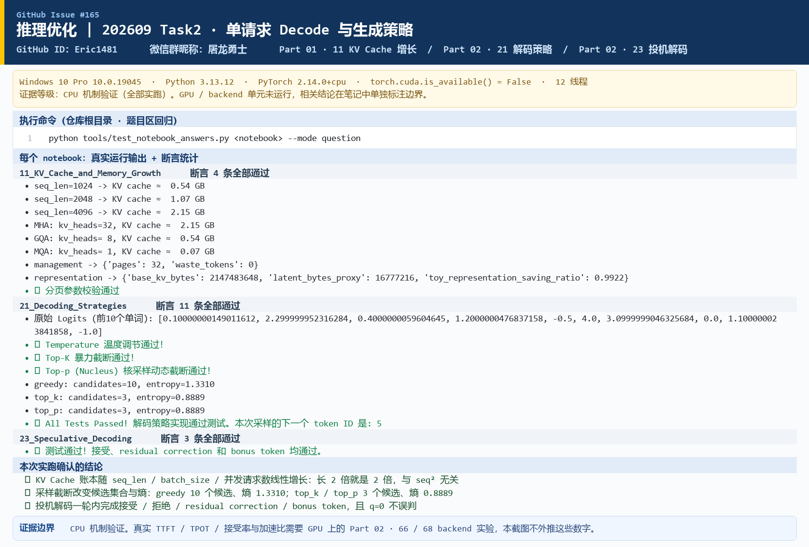

# Task2 · 单请求 Decode 与生成策略 学习笔记

微信群昵称：屠龙勇士 ｜ GitHub ID：Eric1481 ｜ 对应 issue：[#165](https://github.com/datawhalechina/llm-algo-leetcode/issues/165)

DataWhale 开源教程 [llm-algo-leetcode](https://github.com/datawhalechina/llm-algo-leetcode) · 推理优化专题 · Task2

## 0. 环境与实跑证据

| 项目 | 值 |
|:---|:---|
| 环境 | Windows 10 Pro 10.0.19045 / Python 3.13.12 |
| PyTorch | 2.14.0+cpu |
| 线程数 | 12 |
| 硬件 | 无 CUDA 设备（`torch.cuda.is_available() = False`） |

本文结论全部来自 CPU 实跑，命令与输出见下方截图：



> 证据边界：CPU 只能验证**机制与数值逻辑**（账本公式、候选截断、接受/回退控制流）。真实 TTFT / TPOT、接受率和加速比必须走 Part 02 · 66 / 68 的 backend 实验，本文不给出这类数字。

## 1. 最小打卡（Part 01 · 11、Part 02 · 21、Part 02 · 23）

### 1.1 KV Cache 账本公式，以及为什么是线性而不是平方

一节 Token 的 Cache 要保存它在每一层、每个 KV head 上的 K 和 V 两个向量，所以单 Token 的字节数是

$$
\text{bytes/token} = 2 \times L \times H_{kv} \times d \times \text{dtype\_bytes}
$$

其中 $L$ 是层数，$H_{kv}$ 是 KV head 数，$d$ 是 head_dim，系数 2 就是 K 和 V 两份。整段上下文的账本就是

$$
\text{KV bytes} = 2 \times L \times H_{kv} \times d \times S \times B \times \text{dtype\_bytes}
$$

- $S$：序列长度（上下文长度）
- $B$：batch size

**为什么随 $S$、并发和 batch 线性增长，而不是随 $S$ 平方增长。** 关键在于 Attention 算完之后**留下的是什么**。$QK^\top$ 会产生一个 $S \times S$ 的 score 矩阵，但它是中间结果，算完就丢；真正跨 step 留下的只有每个 Token 的 K 和 V。Token 每多一个，就多一组 K/V 向量，是**加法**关系，所以对 $S$ 是 $O(S)$。$S^2$ 只出现在“要不要把 score / 概率矩阵物化下来”这个问题上——这正是 FlashAttention 要消掉的那部分（见 Task1 笔记），和 KV Cache 不是同一件事。

**并发**则是另一个乘数：Cache 是请求级状态，$N$ 个同时在跑的请求各有一份自己的账本，总占用是各请求账本之和。所以 $B$ 和并发请求数都是乘在同一个线性式上的因子。

**实跑核对**（Part 01 · 11，$L=32$、$d=128$、fp16）：

| 配置 | 账本计算 | 实测输出 |
|:---|:---|---:|
| $S=1024$，MHA（$H_{kv}=32$） | $2 \times 32 \times 32 \times 128 \times 1024 \times 2$ | 0.54 GB |
| $S=2048$，MHA | 上面 ×2 | 1.07 GB |
| $S=4096$，MHA | $2 \times 32 \times 32 \times 128 \times 4096 \times 2 = 2{,}147{,}483{,}648$ B | 2.15 GB |
| $S=4096$，GQA（$H_{kv}=8$） | 按 head 数缩到 1/4 | 0.54 GB |
| $S=4096$，MQA（$H_{kv}=1$） | 按 head 数缩到 1/32 | 0.07 GB |

$S$ 翻倍 → 账本翻倍；KV head 从 32 降到 1 → 账本降到 1/32。**这两条都是纯线性关系，没有出现平方项**，和公式一致。

一个直接推论：单请求 $S=4096$ 只要 2.15 GB，但 32 并发就是约 68.7 GB——显存不是被“长上下文”吃掉的，是被“长上下文 × 并发”吃掉的。这就是后面所有 Cache 优化的动机。

### 1.2 KV Cache 压力的优化层面：减少的对象与新增的代价

关键是**先分清每种方法减少的到底是什么对象**，很多讨论把不同层的东西混在一起了。

| 层面 | 代表做法 | 减少的对象 | 新增的代价 |
|:---|:---|:---|:---|
| 架构 / 表示 | MHA → GQA → MQA、MLA | 每 Token 的 Cache 字节（$H_{kv}$ 或 $d$ 变小） | 表达能力可能下降，需要重新训练 / 验证质量 |
| 算子内部 | FlashAttention 分块 | HBM 上**不落** $S \times S$ 中间矩阵 | 不减少 KV Cache 本身；tile 大小受 SRAM 容量约束 |
| 显存管理 | PagedAttention 分页分配 | 连续预留造成的**碎片与尾块浪费** | block table 与调度开销（详见 Task3） |
| 状态复用 | Prefix Cache / RadixAttention | **重复前缀的 Prefill 计算**，不重复存 KV | 缓存本身占显存，要配淘汰与引用计数 |
| 精度压缩 | KV Cache 量化（INT8 / FP8） | 每 Token 的字节数（dtype 减半） | 量化误差，需要质量回归 |
| 调度取舍 | 限制 batch / 并发、抢占、换出 | 同时驻留的并发请求数 | 吞吐下降或延迟抖动 |

在 Part 01 · 11 里顺便看到一个数量级：$S=4096$ 时 base KV 是 2,147,483,648 B，用 latent 表示（MLA 思路，$d_{latent}=64$）后是 16,777,216 B，`toy_representation_saving_ratio = 0.9922`。

> 注意这个 0.9922 是课件里**玩具代理值**，不是真实 MLA 的收益——真实模型还要算上投影、解压和 kernel 代价。它只用来说明“换表示”和“换分配方式”是两个不同量级的杠杆。

### 1.3 Greedy、Temperature、Top-k、Top-p，以及 Temperature 的两面性

| 策略 | 改变了生成过程中的什么 | 观察重点 |
|:---|:---|:---|
| Greedy | 候选集合退化为“只有 argmax 一个”，完全确定 | 确定性、重复率 |
| Temperature | **不改变候选集合，只改变分布形状**：softmax 前把 logits 除以 $T$ | 尖锐度、多样性 |
| Top-k | **固定候选数量**：只保留最大的 k 个 | 固定候选预算 |
| Top-p | **动态候选数量**：保留累计概率首次达到 $p$ 的最小集合 | 候选数随分布形状自适应 |

三者都会改变 softmax 的**分母**：Temperature 缩放 logits，Top-k / Top-p 把被截断的位置置为 $-\infty$，于是概率在剩下的候选上重新归一化。

**为什么提高 Temperature 会增加多样性、却可能降低稳定性。** $T$ 是把 logits 除以温度后再过 softmax：$T<1$ 相当于放大 logits 间的差距，分布更尖；$T>1$ 相当于压缩差距，分布更平。分布被拉平之后，**原本概率极低的 token 也拿到了可观的采样概率**，所以同一段 prompt 在不同随机种子下更容易走到不同分支——多样性上来了。代价是：

1. 采样结果的方差变大，重复运行不一致，难以复现和回归；
2. 长序列上每一 step 的小概率偏航会累积，输出可能中途跑题或崩坏；
3. $T$ 很大时分布接近均匀，模型学到的偏好被抹平，质量下降。

要特别注意一个边界：**Temperature 不变排序**（实跑里用 `argsort` 断言过），所以它很小时只是“更接近 greedy”，**并不等于 greedy**；真正的确定性由 `do_sample=False` 单独表达。

**实跑输出**（Part 02 · 21，同一组 logits）：

```text
greedy: candidates=10, entropy=1.3310
top_k:  candidates=3,  entropy=0.8889
top_p:  candidates=3,  entropy=0.8889
```

候选数从 10 降到 3，熵从 1.3310 降到 0.8889，说明截断实实在在压缩了候选空间。`top_p` 在 $p=0.8$ 时也落在 3 个候选上——但它是**按累计概率自己算出来的 3**，不是外部指定的 3，这就是它和 top-k 的本质区别。

另外一条容易踩的细节：top-p 的边界语义是“**首次达到阈值**的那个 token 要被保留”，所以掩码要向右平移一位再取反；少这一步会把边界 token 一起切掉。实现里我按 `sorted_indices_to_remove[..., 1:] = sorted_indices_to_remove[..., :-1].clone()` 平移，并用 `scatter_` 把 sorted logits 还原回原词表顺序。

### 1.4 投机解码：草稿与目标各做什么

**投机解码（Speculative Decoding）的核心是把“一次前向只能出一个 token”换成“一次验证能确认多个 token”。**

分工是：

| 角色 | 职责 | 特点 |
|:---|:---|:---|
| 草稿模型（draft） | 自回归地快速提出 $K$ 个候选 token，并给出自己的概率 $q$ | 小、快、便宜；**允许不准** |
| 目标模型（target） | 对 $K$ 个位置各算一次概率 $p$，逐个判定接受或拒绝 | 大、慢、贵；**负责正确性** |

目标模型的验证是**一次前向并行完成**的——这是收益的来源：$K$ 个候选的验证成本接近一次普通前向，但最好情况下能推进 $K+1$ 个 token。

拒绝不是简单丢弃，否则输出分布就和目标模型不一致了。课件用的规则是：

- 候选 token 的接受概率 $\alpha = \min\left(1, \dfrac{p}{q}\right)$，其中 $p$ 是目标概率、$q$ 是草稿概率；
- 一旦在第 $i$ 个位置被拒绝，就**停止**，从残差分布 $\text{residual} = \text{normalize}(\max(p - q, 0))$ 重新采一个修正 token；
- 如果 $K$ 个候选全部通过，再从目标模型在位置 $K$ 的分布里采一个 bonus token，所以一轮最多能拿到 $K+1$ 个 token。

这个接受 / 拒绝采样保证最终产出的分布与目标模型直接采样**等价**——投机解码是加速手段，不是近似采样。

**实跑验证的控制流**（Part 02 · 23，3 条断言全部通过）：

```text
必接受位置 → 接受并继续
必拒绝位置 → 从 residual 采到修正 token 3，返回 tokens=[0, 3]、accepted_count=1、rejected=True
全部接受   → 追加 bonus token 4，返回 tokens=[0, 3, 2, 4]、accepted_count=3
```

两个边界我特意核对了：**$q=0$ 但 $p>0$** 时候选仍应被接受（不能因为除零就误判拒绝）；**residual 概率质量为 0** 时必须明确报错，而不是采出一个无意义的 token。

## 2. 学有余力增项 1（03 解码策略、Part 02 · 35 多 Token 解码）

### 2.1 什么叫多 Token 解码

多 Token 解码（Multi-Token Decoding）是**在一次解码步里尝试推进多个 token**：先由草稿路径一次提出一段候选，再按顺序验证，保留连续通过的前缀，在**首次拒绝处回退**。

它针对的瓶颈是“一轮只推进一个 token”带来的固定开销：每 step 都要重新进入 decoder、重新调度 kernel、重新读写 KV Cache。输出越长，这些 per-step 开销的占比越高，所以提高**单轮推进量**本身就是收益。

衡量指标不是单纯的接受率，而是单轮实际推进了多少：

$$
\text{progress\_per\_round} = \frac{\text{accepted\_len}}{\text{len(proposed\_tokens)}}
$$

### 2.2 与投机解码的区别：候选生成与目标验证

两者共享“提议 → 验证 → 回退”的外层流程，但**关注点和严格程度不同**：

| 对比项 | 投机解码（Part 02 · 23） | 多 Token 解码（Part 02 · 35） |
|:---|:---|:---|
| 候选生成 | 草稿模型自回归生成，给出概率分布 $q$ | 草稿路径一次提出一段候选序列，可来自多头 / 多 draft 等结构 |
| 目标验证 | 严格按 $\alpha=\min(1,p/q)$ 做接受 / 拒绝采样，并要求与目标分布**等价** | 本课件的教学规则是**近似**的：目标概率达到草稿概率的一定比例即接受 |
| 拒绝后的处理 | 从残差分布 $\max(p-q,0)$ 归一化后**重新采样**修正 token | 回退到首次拒绝处，丢弃其后的候选，重新生成 |
| 关键指标 | acceptance rate、draft cost、TPOT | 接受长度、`progress_per_round`、验证成本 |
| 主要问题 | 分布是否正确、加速多少 | **一轮最多推进多少 token**、首次拒绝如何影响有效进度 |

一句话区分：**投机解码把“正确性”放在中心（分布必须不变），多 Token 解码把“单轮推进效率”放在中心（连续接受多长）。** 本课件的多 Token 实现明确说明接受规则是教学近似，不等同于 23 节的分布保持算法，这个边界不能糊过去。

### 2.3 一轮里候选、验证结果与状态更新的关系

一轮内部是一条严格的状态链：

```text
提议序列（截断到 max_proposal_len）
   → 从左到右逐个验证（顺序不能打乱）
       ├─ 接受：追加进 accepted_tokens，继续验证下一个
       └─ 首次拒绝：记录 rejected_at，立刻 break
   → 汇总：accepted_tokens 直接写入输出；rejected_suffix = proposed[rejected_at:] 丢弃 / 重算
   → 状态更新：只有 accepted_tokens 会让 KV Cache 前进；被拒绝的后缀不进 Cache
```

三个要点：

1. **候选序列有前缀依赖**，所以必须从左到右验证。第 $i$ 个被拒绝时，第 $i+1$ 个候选是在“错误前缀”下提出的，不再可靠——这就是“首次拒绝即停止”的原因。
2. `max_proposal_len` 是核心权衡：**提得越长理论加速空间越大，但被拒绝和回退的概率也越高**。参数过大或过小都会反过来损失收益。
3. **收益的前提是验证成本低于逐 token 生成成本**。如果验证本身很贵（例如 draft 太长、目标模型 batch 效率差），多 Token 解码可能反而不划算。

实跑确认（Part 02 · 35）：`MultiTokenDecoderSim 测试通过`，覆盖了提议截断、逐 token 验证、首次拒绝回退后缀、全部接受时后缀为空这几条控制流。

## 3. 学有余力增项 2（Part 02 · 66、Part 02 · 68）

按 issue 的“4 选 2”，我选第 (2)、(3) 问。

### 3.1 设计最小实验比较不同采样策略对质量、重复率和生成长度的影响（第 2 问）

**固定项**（必须写进报告，否则结论不可复查）：模型与版本、backend、dtype、prompt 集合与长度、`max_new_tokens`、随机种子列表、batch / 并发。

**自变量**：`temperature`、`top_k`、`top_p`、`do_sample`。

**因变量与测量方式**：

| 指标 | 怎么测 | 注意 |
|:---|:---|:---|
| 质量 | 任务准确率 / 与参考输出的匹配度，或人工小样本标注 | CPU 上只能验机制，质量结论需要真实模型 |
| 重复率 | `distinct-n`（n-gram 去重比）、最长重复片段占比 | 低 Temperature 容易高重复 |
| 生成长度 | 实际生成 token 数、命中 EOS 的比例 | 必须和 `max_new_tokens` 一起看，截断会污染长度结论 |
| 稳定性 | 同一 prompt 跑 $n$ 个种子，看输出的方差 / 一致率 | 这是 Temperature 的直接代价，不能只看单次结果 |

**最小的可执行设计**：固定同一个 prompt 集合，用网格扫 `temperature ∈ {0.2, 0.7, 1.0, 1.5}` × `top_p ∈ {0.8, 0.9, 1.0}`，每个配置跑固定 $n$ 个种子，输出聚合表（质量均值、`distinct-3`、平均长度、长度标准差）。greedy 作为**确定性基线**单独一组，用来对照“采样带来的方差”。

### 3.2 为什么必须同时记录 TTFT、TPOT、吞吐、峰值显存和端到端延迟（第 3 问）

这些指标各自回答一个**不同的问题**，任何单看一个都会得出偏斜结论：

| 指标 | 回答什么问题 | 单看它会漏掉什么 |
|:---|:---|:---|
| TTFT（首 token 延迟） | 用户多久看到**第一个**字；受 Prefill 与排队主导 | 看不到逐 token 的稳定度 |
| TPOT（每 token 时间） | Decode 阶段**逐 token 的推进速度**；受 KV Cache 访问与调度主导 | 看不到长输入的启动代价 |
| 吞吐（tokens/s） | 单位时间服务能力，是**成本 / 容量**视角 | 高吞吐可能靠大 batch 堆出来，交互体验反而更差 |
| 峰值显存 | **容量上限**在哪，能开多大 batch / 多长上下文 | 平均值会掩盖瞬时峰值，而 OOM 只看峰值 |
| 端到端延迟 | 一个完整请求的真实完成时间 | 会被输出长度主导，跨不同长度不可比 |

**为什么不能只比平均延迟。** 平均值会把尾部的糟糕体验平均掉。在线服务里用户感知的是慢请求，所以必须同时看 **P95 / P99**：吞吐提升但 P99 恶化，意味着少数用户承担了全部代价。指标之间还经常互相矛盾——大 batch 提吞吐但抬 TTFT / TPOT，长上下文省调度但吃显存——所以结论必须是“**在固定 workload 和 SLA 下**，哪一项改善了、哪一项付出了代价”，而不是笼统地说“更快了”。

## 4. 小结

把 Task2 串起来是一条从“状态”到“加速”的链：

1. **状态**：Decode 每步都要读取历史 K/V，KV Cache 因此是请求级状态，账本对 $S$、batch、并发都是线性的（$2LH_{kv}dSB\cdot\text{dtype}$），$S^2$ 只在中间矩阵上出现。
2. **优化分层**：减少表示（GQA / MQA / MLA）、减少分配浪费（分页）、减少重复计算（前缀复用）、减少驻留（调度 / 量化）——对象和代价各不相同。
3. **单步生成**：Greedy 定义确定性基线；Temperature 调分布形状而不改候选集；Top-k 固定候选数、Top-p 动态定候选数，两者都改变 softmax 分母与熵。
4. **单轮加速**：投机解码用草稿提议 + 目标严格验证换取 $K+1$ 个 token，且保持分布等价；多 Token 解码关注单轮推进量和首次拒绝回退，接受规则是教学近似。
5. **验证出口**：机制能在这台 CPU 上跑通并自洽，但 TTFT / TPOT / 接受率 / 加速比一律需要 Part 02 · 66 / 68 的 GPU backend 实验——本文所有性能类结论都停在这里。

## 参考链接

**本项目课件**

- [Part 01 · 11 KV Cache 与显存增长](../../../01_Hardware_Math_and_Systems/11_KV_Cache_and_Memory_Growth.ipynb)
- [Part 02 · 21 解码策略](../../../02_PyTorch_Algorithms/21_Decoding_Strategies.ipynb)
- [Part 02 · 23 投机解码](../../../02_PyTorch_Algorithms/23_Speculative_Decoding.ipynb)
- [Part 02 · 35 多 Token 解码](../../../02_PyTorch_Algorithms/35_Multi_Token_Decoding.ipynb)
- [03 解码策略](../../../topic_discussion/inference_optimization/03_decoding_strategies.md)
- [06 基准测试与决策](../../../topic_discussion/inference_optimization/06_benchmark_and_decision.md)

**论文与文档**

- [Fast Inference from Transformers via Speculative Decoding](https://arxiv.org/abs/2211.17192)
- [The Curious Case of Neural Text Degeneration（Nucleus Sampling）](https://arxiv.org/abs/1904.09751)
- [Medusa: Simple LLM Inference Acceleration Framework with Multiple Decoding Heads](https://arxiv.org/abs/2401.10782)
- [vLLM Speculative Decoding 文档](https://docs.vllm.ai/en/latest/features/speculative_decoding/)
- [HuggingFace 文本生成策略文档](https://huggingface.co/docs/transformers/main/en/main_classes/text_generation)
