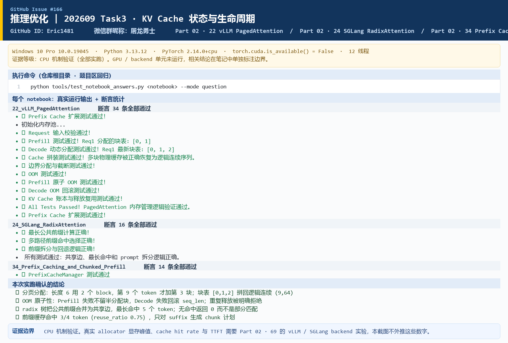

# Task3 · KV Cache 状态与生命周期 学习笔记

微信群昵称：屠龙勇士 ｜ GitHub ID：Eric1481 ｜ 对应 issue：[#166](https://github.com/datawhalechina/llm-algo-leetcode/issues/166)

DataWhale 开源教程 [llm-algo-leetcode](https://github.com/datawhalechina/llm-algo-leetcode) · 推理优化专题 · Task3

## 0. 环境与实跑证据

| 项目 | 值 |
|:---|:---|
| 环境 | Windows 10 Pro 10.0.19045 / Python 3.13.12 |
| PyTorch | 2.14.0+cpu |
| 线程数 | 12 |
| 硬件 | 无 CUDA 设备（`torch.cuda.is_available() = False`） |

本文结论全部来自 CPU 实跑，命令与输出见下方截图：



> 证据边界：CPU 只能验证**块表账本、OOM 原子性、前缀匹配与分块计划**这些逻辑。真实 allocator 的显存峰值、backend 的 cache hit rate 和 TTFT 改善必须走 Part 02 · 69 的 vLLM / SGLang 实验，本文不给出这类数字。

## 1. 最小打卡（Part 02 · 22、Part 02 · 24）

### 1.1 PagedAttention：为什么要把连续的 KV Cache 拆成固定大小的 block

**它解决的问题是连续显存分配下的碎片与预留浪费。** 如果每个请求都要求一段**连续**的显存来放自己的 KV Cache，会有两个后果：

- 长度不可预知，只能按最大可能长度**预留**，用不到的部分白白占着；
- 请求来去之后，池子里剩下的是大小不一的小空洞，新请求即使总空闲量够，也找不到足够长的一段连续空间 → 被迫 OOM 或降并发。

**PagedAttention 的做法**：把 KV Cache 切成固定大小的 **block**（例如 16 个 token 一块），请求按需申请 block，块与块之间**不需要物理连续**。这就把“连续内存分配”问题变成了“固定大小页的分配”问题——和操作系统的虚拟内存分页同构：碎片被限制在“最后一块的尾部”，而不是整个池子。

**逻辑 token 位置 / 物理 KV block / block table 的关系**：三者是“逻辑 → 映射 → 物理”的一层间接。

| 概念 | 是什么 | 在实跑里的样子 |
|:---|:---|:---|
| 逻辑 token 位置 | 请求视角的连续下标 $0,1,2,\dots$ | 请求长度 `seq_len` |
| 物理 KV block | 显存池里固定大小的一块，有全局编号 | `physical_kv_cache[num_blocks, block_size, head_dim]` 的一行 |
| block table | 请求私有的映射表：第 $i$ 个逻辑块 → 哪个物理块 | `req.block_table = [0, 1, 2]` |

**为什么逻辑连续不要求物理地址连续。** 因为 kernel 读 Cache 时是**通过 block table 反查**的：需要第 $t$ 个 token 时，先算它属于第 $\lfloor t / \text{block\_size} \rfloor$ 个逻辑块，再查 block table 拿到物理块号，最后在块内偏移 $t \bmod \text{block\_size}$。既然每次访问都要经过这次查表，“物理上挨着”就不再是正确性前提——逻辑连续由**映射表**保证，而不是由物理布局保证。

这也是为什么分页能顺带支持 Prefix Cache 的块共享：两个请求只要 block table 指向同一批物理块就行，无需复制数据（详见 24 与 34）。

**实跑核对**（Part 02 · 22，`num_blocks=10`、`block_size=4`，34 条断言全部通过）：

```text
初始化内存池...
✅ Request 输入校验通过！
✅ Prefill 测试通过！Req1 分配的块表: [0, 1]          # 长度 6 → ceil(6/4)=2 块，空闲池剩 8
✅ Decode 动态分配测试通过！Req1 最新块表: [0, 1, 2]    # 第 7、8 个 token 不换块，第 9 个才加第 3 块
✅ Cache 拼装测试通过！多块物理缓存被正确恢复为逻辑连续序列。   # [0,1,2] 拼回 (9, 64) 并截到最后一块的真实长度
✅ 边界分配与截断测试通过！                            # 长度 4 → 恰好 1 块；第 5 个 token 触发第 2 块
✅ OOM 测试通过！
✅ Prefill 原子 OOM 测试通过！                         # 失败不留半分配块，空闲池不被部分消耗
✅ Decode OOM 回滚测试通过！                           # 失败后 seq_len 不改变
✅ KV Cache 账本与释放复用测试通过！                    # 重复释放被明确拒绝
```

三条我特意验证的边界，它们正是分页实现最容易出错的地方：

1. **跨块判定**：`new_seq_len % block_size == 1` 才是“刚跨进新块”的时刻。长度 6 时第 7 个 token 还在第 2 块里，第 9 个 token 才需要第 3 块。
2. **OOM 原子性**：`Prefill` 必须先确认空闲块足够**再**改 `free_blocks` 和 `block_table`；否则失败会留下半分配状态。`Decode` 同理，失败时 `seq_len` 必须回滚。
3. **尾块浪费**：块分配是向上取整的，长度 5 用 2 块（8 个 token 槽）→ 浪费 3 槽，`utilization = 5/8 = 0.625`。这就是“碎片被限制在最后一块”，但**没有消失**。

顺带一个容量账本（`num_blocks=4, block_size=4, num_layers=2, num_kv_heads=8, head_dim=16, fp16`）：单 token 是 $2\times2\times8\times16\times2 = 1024$ B，单块 $4\times1024 = 4096$ B，池总容量 $4\times4096 = 16384$ B——和断言一致。

### 1.2 RadixAttention：前缀树如何组织多请求的 Cache，最长前缀匹配起什么作用

**RadixAttention 用一棵前缀树（radix tree）组织多个请求的 KV Cache。** 树上的每条边带一段 token 序列，从根到某个节点的路径就是一段被缓存的前缀；**不同请求的公共前缀在树上合并成同一条边**，因此只存一份 KV。

和 PagedAttention 对比一下就很清楚：PagedAttention 管的是“**一块显存怎么分配给一个请求**”，RadixAttention 管的是“**多个请求的相同前缀怎么只算一次**”。前者是分配机制，后者是复用机制。

**实跑核对**（Part 02 · 24，16 条断言全部通过）：

```text
✅ 最长公共前缀计算正确！
✅ 多路径前缀命中选择正确！
✅ 前缀拆分与回退逻辑正确！

 所有测试通过：共享边、最长命中和 prompt 拆分逻辑正确。
```

测试里插入了 `[0,1,2,3]`、`[0,1,2,3,4]`、`[9,9,9]` 三条路径，可以观察到两件关键行为：

1. **共享边与边分裂**：`[0,1,2,3]` 和 `[0,1,2,3,4]` 的前 4 个 token 相同，树把它们合并成一条 `[0,1,2,3]` 的共享边，`[4]` 作为它的子节点。如果已经存在一条更长的边 `[0,1,2,3,7]`，再来一个 `[0,1,2,3,4]`，就需要**在公共长度处分裂边**：原边截成 `[0,1,2,3]`，旧后缀 `[7]` 和新后缀 `[4]` 各挂一个子节点。实跑断言正是查这一条（`shared.key_tokens == [0,1,2,3]`、`len(shared.children) == 1 and shared.children[0].key_tokens == [4]`）。
2. **最长前缀匹配**：`match_prefix([0,1,2,3,4,5])` 返回 5，`match_prefix([7,6,5])` 返回 0。

**最长前缀匹配在请求处理中起的作用，是决定“这次 Prefill 到底要从哪儿开始算”。** 请求进来后：

```text
prompt = reusable_prefix + suffix
hit_len  = match_prefix(prompt)      # 从开头连续命中的长度
reusable_prefix = prompt[:hit_len]   # 这段的 KV 直接用缓存里的
suffix          = prompt[hit_len:]   # 只有这段需要真正 Prefill
```

于是被跳过的不是“存 KV 的开销”，而是**这段前缀的 Prefill 计算**。命中从开头连续才算数——中间位置偶然相同的 token 不构成前缀命中，这一点测试用 `match_prefix([1,2,0]) == 0` 卡死了。

还有一个语义细节：**只有 `terminal` 节点才算完整可复用前缀**。树上可能有一条边只被走了一半（比如某请求的 prompt 是别人的前缀），那部分路径没有完整的边界语义，不能当作可命中的缓存。实现在匹配循环里对每个走过的节点判断 `if node.terminal: best_match_len = offset`。

### 1.3 RadixAttention 与 PagedAttention 的区别

| 对比项 | PagedAttention（vLLM） | RadixAttention（SGLang） |
|:---|:---|:---|
| 解决的问题 | **内存分配管理**：连续分配造成的碎片 / 预留浪费 | **前缀复用**：多请求重复前缀的重复 Prefill |
| 核心数据结构 | block table（逻辑块 → 物理块） | radix tree（从根到节点的 token 路径共享边） |
| 决策时机 | 请求进入和每次跨块时分配 / 释放物理块 | 请求进入时做一次最长前缀匹配，决定从哪开始算 |
| 复用的东西 | 物理块可被多个请求的 block table 指向（共享的载体） | 已经算好的前缀 KV 及其对应的树路径 |
| 减少的代价 | 碎片与尾块浪费 → 更高并发、更少 OOM | 重复 Prefill 计算 → 更低的 TTFT（前缀占比越高越明显） |
| 新增的代价 | block table 查表与调度开销 | 树维护 + 缓存驻留，需要淘汰策略与引用计数 |
| 主要观察指标 | Block 利用率、尾块浪费、峰值显存 | `hit_len` / `reused_tokens`、TTFT、cache hit rate |

**两个角度区分**：

- 从“**内存分配管理**”看：PagedAttention 回答“池子里的块怎么分配、怎么回收、碎片怎么控制”。它不关心两个请求内容像不像。
- 从“**前缀复用**”看：RadixAttention 回答“哪些 token 已经被算过、能不能跳过”。它本身不规定物理块怎么分配——真实系统里两者是**叠加**的：RadixAttention 找出可复用的前缀，这些前缀的物理块通过引用计数共享（这正是 22 节的可选扩展 `acquire_prefix` / `release_prefix` 在做的事）。

一句话：**PagedAttention 让显存能被灵活分块，RadixAttention 让已经分好的块按前缀被复用；前者解决“装得下”，后者解决“不用重算”。**

## 2. 学有余力增项 1（04 KV Cache 生命周期与复用、Part 02 · 34）

### 2.1 KV Cache 从请求进入到释放经历哪些状态

按课件 04 的“建立 → 追加 → 复用 → 释放”四阶段，把状态和触发事件对齐：

| 阶段 | 触发事件 | Cache 状态变化 | 重点观察 |
|:---|:---|:---|:---|
| 建立 | 请求到达、Prefill 开始 | 按 `ceil(prompt_len / block_size)` 分配物理块，写入整段 prompt 的 K/V | 初始块数、预留量 |
| 追加 | 每步 Decode 生成新 token | `seq_len += 1`；**只有跨块时**才新申请 1 块 | 扩容次数、TPOT、峰值显存 |
| 命中 | 新请求的最长前缀匹配成功 | 命中部分**直接引用**已有块（引用计数 +1），只对 suffix 建新块 | `hit_len`、`reused_tokens`、TTFT |
| 释放 / 驱逐 | 请求结束，或容量不足需要回收 | 引用计数归零才归还物理块；容量紧张时按保留分数驱逐 | 回收情况、驱逐次数、并发边界 |

实跑里能看到这条链的每一环：`allocate_for_prefill`（建立）→ `allocate_for_decode`（追加，跨块判定）→ `get_physical_cache`（按块表还原逻辑连续序列）→ `release_request`（释放，且**重复释放必须报错**，否则同一物理块会被加入 `free_blocks` 两次，后续被两个请求同时写坏）。

### 2.2 Prefix Cache 如何减少重复 Prefill，命中后能跳过什么

**Prefix Cache 用最长公共前缀（LCP）决定复用边界：命中多少 token，就跳过多少 token 的 Prefill。**

命中后跳过的具体计算是：

```text
hit_len 之前：不重算 forward，不重新写 KV —— 直接引用已有 KV（KV 查表）
hit_len 之后：只对 suffix 做 Prefill
```

注意**被跳过的是 Prefill 的前向计算**，不是“KV 的显存占用”——缓存本身照样占显存。所以 Prefix Cache 是**用显存换计算**，前缀越长、复用次数越多才越划算。

**实跑核对**（Part 02 · 34，`block_size=2`，14 条断言全部通过）：

```text
manager.add_prefix([1, 2, 3]); manager.add_prefix([1, 2, 9]); manager.add_prefix([1, 2, 3])  # 重复登记不增加条目
manager.cached_prefixes == [(1, 2, 3), (1, 2, 9)]
manager.chunked_prefixes[0] == [(1, 2), (3,)]      # 分块结果按 block_size 对齐

manager.match_prefix([1, 2, 3, 9]) == 3            # 从开头连续命中 3 个
manager.match_prefix([1, 2, 9, 8]) == 3
manager.match_prefix([1, 2, 0])    == 0            # 第 3 个 token 不匹配 → 命中长度为 0，而不是 2

split_prompt([1, 2, 3, 9]) == ([1, 2, 3], [9], 3)
cache_stats([1, 2, 3, 9])  == {'hit_tokens': 3, 'uncached_tokens': 1, 'reuse_ratio': 0.75}
chunked_prefill_plan([1, 2, 3, 4, 5]) == [(1, 2), (3, 4), (5,)]        # 不整除时最后一块是短块
chunked_suffix_prefill_plan([1, 2, 3]) == []                            # 完整命中 → 不需要算任何 chunk
```

`match_prefix([1, 2, 0]) == 0` 这条最值得记：**它是 0 不是 2**，因为前缀命中要求“从开头连续”。这个口径如果不严，就会出现“中间某段碰巧一样就复用”的错误，直接用错 KV。

### 2.3 Chunked Prefill 为什么要把长输入拆成区段，以及它如何影响 Prefill / Decode 的调度关系

**Chunked Prefill 把长 prompt 拆成多个 chunk，逐块执行 Prefill，而不是一次性算完。**

它要解决的不是“Attention 算得慢”，而是**“一次长 Prefill 会把正在 Decode 的请求饿死”**：一个 4096 token 的 prompt 如果作为一个不可分割的大任务提交，它会在这一轮独占 GPU 的计算和显存带宽，同一时刻其他请求的 Decode 只能排队，表现为 **TPOT 抖动和 P99 恶化**。拆成 chunk 之后，**每个 chunk 之间可以插入 Decode**，于是单次 Prefill 对延迟和显存峰值的冲击被摊平。

实跑里能看到切块本身（`suffix_tokens=4096`、`chunk_size=512` → `chunk_count=8`，以及 `chunked_suffix_prefill_plan` 只对未命中的 suffix 切块），这正是调度粒度改变的证据。

**它对 Prefill / Decode 调度关系的影响**：

| 维度 | 不拆（完整 Prefill） | 拆（Chunked Prefill） |
|:---|:---|:---|
| 调度粒度 | 一个请求的 Prefill 是不可分割的大任务 | 一次只提交一个 chunk，粒度小得多 |
| Decode 影响 | 长 Prefill 期间 Decode 被整段阻塞 | 每个 chunk 之间可插入 Decode，抖动被摊平 |
| 显存峰值 | 单次工作集大，峰值高 | 单次工作集小，峰值降低 |
| TTFT | 长 prompt 一次性算完，可能更快 | chunk 之间要排队，**TTFT 可能不变甚至变差** |
| 总计算量 | — | **不减少**（FLOPs 一样，只是分批） |

**代价必须说清楚**：Chunked Prefill **不减少总计算量**，换来的只是“不霸占资源”；而且分块调度本身有开销，chunk 太小会导致调度次数暴涨、每次的固定开销占比过高。

还要避免一个常见混淆：Chunked Prefill 的分块和 FlashAttention 的 tiling **层级完全不同**——前者沿 **prompt 序列**切、属于**请求调度粒度**；后者沿序列和 head_dim 切成 tile、属于**算子内部访存优化**。名字都叫“分块”，解决的问题不一样。

### 2.4 小结：三种机制的关系

| 机制 | 改变层级 | 减少的对象 | 实跑验证的产物 |
|:---|:---|:---|:---|
| PagedAttention | 物理分配 | 碎片 / 预留浪费 | 块表分配、OOM 原子性、尾块利用率 |
| RadixAttention / Prefix Cache | 状态复用 | 重复前缀的 Prefill 计算 | 命中长度、prefix/suffix 拆分、`reuse_ratio` |
| Chunked Prefill | 请求调度 | 单次 Prefill 的资源占用 | chunk 计划、只对 suffix 切块 |

三者可以叠加，但不能视为同一种优化：**一个管装得下，一个管不用重算，一个管不霸占。**

## 3. 学有余力增项 2（Part 02 · 66、Part 02 · 69 Prefix Cache）

按 issue 的 3 问作答。

### 3.1 TTFT、TPOT、吞吐、峰值显存和 P99 分别反映什么

| 指标 | 反映链路中的哪一段 | 主要受什么支配 |
|:---|:---|:---|
| TTFT | 从请求到达到**第一个 token** 产出 | Prefill 计算、排队、**Prefix Cache 命中** |
| TPOT | 首 token 之后**每个 token** 的推进速度 | Decode 计算、KV Cache 读取带宽、batch 组织 |
| 吞吐 | 单位时间完成的服务量 | batch / 并发、GPU 利用率、调度效率 |
| 峰值显存 | **容量上限**：能开多大 batch、多长上下文、多少并发 | KV Cache 账本 + 碎片 + 临时工作集 |
| P99 延迟 | **尾部体验**：最慢那批请求有多慢 | 排队积累、长 Prefill 抢占、驱逐抖动 |

注意 Prefix Cache 的直接作用点是 **TTFT**（少算了一段 Prefill），它对 TPOT 基本没有直接帮助——除非命中后腾出的显存让 batch 变大，那又绕回吞吐和显存了。所以判断 Prefix Cache 是否生效，不能只看 TTFT，也不能只凭“缓存开着”。

### 3.2 如何定义一次有效的 Prefix Cache 命中，为什么 token 内容、位置和模型配置必须一致

**有效命中的定义**：新请求的 prompt 从**开头连续**匹配到一段已有缓存，且这段缓存对应的 KV 张量**确实可以被当前请求直接使用**——两个条件都要满足，缺一不可。

- 只满足第一条（token 从开头连续相同）但 KV 张量不可用 → 是**逻辑命中**，不是有效命中，实际还得重算。
- token 相同但**不连续命中**（中间某处不同）→ 前缀缓存的口径下命中长度为 0，不算命中。

**为什么三个一致性都必须满足**：

| 一致性 | 为什么必须一致 | 不一致的后果 |
|:---|:---|:---|
| **token 内容** | KV 是 token 序列的函数，内容不同 → K/V 数值不同 | 复用了错误的 KV，输出错乱（**静默错误**，最危险） |
| **位置** | RoPE 等位置编码把位置写进了 K，同一 token 在不同位置 K 不同 | 位置错位，Attention 打到的相对位置全错 |
| **模型配置** | 不同模型的层数 / head 数 / head_dim / 权重 / dtype 都不一样，KV 张量形状和数值都不可互换 | 形状不匹配直接报错，或数值无意义 |

再加一条工程上同样的硬条件：**必须同一个实例（或能共享该 KV 的实例）**。跨实例复用 KV Cache 需要显式的 KV 传输（这正是 PD 分离里“状态交接”的来源），不是本地查表能解决的。

### 3.3 如何同时计算命中率、复用 token 数、TTFT 改善和缓存维护成本；为什么命中率提升不一定代表值得上线

**四类量要分别测，口径先写清楚再测：**

| 量 | 计算方式 | 口径提醒 |
|:---|:---|:---|
| 命中率 | `hit_requests / total_requests` 或 token 级 `reused_tokens / total_prompt_tokens` | **请求级和 token 级会给出完全不同的数字**，必须写明是哪一个 |
| 复用 token 数 | 每次请求的 `hit_len` 之和 | 直接用 `split_prompt` 返回的 `hit_len`，见实跑的 3/4 = 0.75 |
| TTFT 改善 | 同一 workload 下 `TTFT(开启) − TTFT(baseline)`，看均值**和 P95 / P99** | 必须固定 prompt 分布、generated tokens、batch、并发 |
| 维护成本 | 缓存占用的显存、查找开销、淘汰次数、失效重算量 | 与 66 的 baseline 用同一套模型 / backend / 硬件 |

**为什么命中率提升不一定代表 Prefix Cache 值得上线**，至少四个理由：

1. **命中率本身不带收益信息**。命中一个很短的公共 system prompt，复用 20 个 token，TTFT 几乎不动；命中率数字却很漂亮。
2. **缓存占显存，可能反噬并发**。缓存越激进，能并发跑的请求越少，吞吐可能下降——这和 66 里“峰值显存换了什么”是同一个权衡。
3. **维护成本可能超过收益**。查找、引用计数、驱逐都要 CPU 和同步开销；请求前缀差异大时命中率低但开销照付。
4. **可能只改善了均值、恶化了尾部**。TTFT 均值下降但 P99 上升（例如淘汰抖动），在线服务的用户体验反而更差。

**应该怎么和 66 的 baseline 对照**：固定模型、backend、dtype、prompt tokens、generated tokens、batch、并发、cache policy，**只切换 prefix cache 开关**，然后在同一张表里同时记录 TTFT（均值 / P95 / P99）、TPOT、吞吐、峰值显存、命中率与 `reused_tokens`、以及 `evidence_level`。只有当**质量不降、资源预算不超、目标指标改善**三者同时成立时才给 accept；指标不稳定或证据不足时应给 tune，而不是靠单次测试下结论。

## 4. 小结

1. **分配**：PagedAttention 用固定大小 block + block table 把连续分配变成页式分配，碎片只剩最后一块的尾部；逻辑连续由映射表保证，不需要物理连续。OOM 必须是原子的。
2. **复用**：RadixAttention 用前缀树的共享边组织多请求 Cache，最长前缀匹配决定从哪开始 Prefill；只有从开头连续命中且节点是 terminal 才算数。
3. **分工**：PagedAttention 解决“装得下”，RadixAttention / Prefix Cache 解决“不用重算”，Chunked Prefill 解决“不霸占”，三者层级不同、可叠加。
4. **验证出口**：块表账本、OOM 回滚、前缀匹配、分块计划都能在 CPU 上验证通过；真实命中率、TTFT 改善和显存收益必须走 Part 02 · 69 / 66 的 backend 实验——本文所有性能类结论都停在这里。

## 参考链接

**本项目课件**

- [Part 02 · 22 vLLM PagedAttention](../../../02_PyTorch_Algorithms/22_vLLM_PagedAttention.ipynb)
- [Part 02 · 24 SGLang RadixAttention](../../../02_PyTorch_Algorithms/24_SGLang_RadixAttention.ipynb)
- [Part 02 · 34 Prefix Caching 与 Chunked Prefill](../../../02_PyTorch_Algorithms/34_Prefix_Caching_and_Chunked_Prefill.ipynb)
- [Part 01 · 11 KV Cache 与显存增长](../../../01_Hardware_Math_and_Systems/11_KV_Cache_and_Memory_Growth.ipynb)
- [04 KV Cache 生命周期与复用](../../../topic_discussion/inference_optimization/04_kv_cache_lifecycle_and_reuse.md)
- [06 基准测试与决策](../../../topic_discussion/inference_optimization/06_benchmark_and_decision.md)

**论文与文档**

- [PagedAttention / vLLM（arXiv:2309.06180）](https://arxiv.org/abs/2309.06180)
- [SGLang / RadixAttention（arXiv:2312.07104）](https://arxiv.org/abs/2312.07104)
- [vLLM 官方仓库](https://github.com/vllm-project/vllm)
- [SGLang 官方仓库](https://github.com/sgl-project/sglang)
