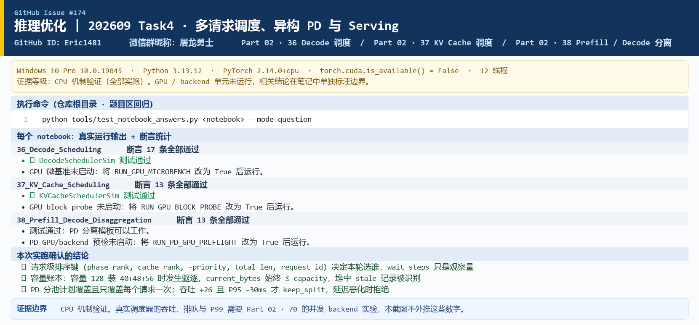

# Task4 · 多请求调度、异构 PD 与 Serving 学习笔记

微信群昵称：屠龙勇士 ｜ GitHub ID：Eric1481 ｜ 对应 issue：[#174](https://github.com/datawhalechina/llm-algo-leetcode/issues/174)

DataWhale 开源教程 [llm-algo-leetcode](https://github.com/datawhalechina/llm-algo-leetcode) · 推理优化专题 · Task4

## 0. 环境与实跑证据

| 项目 | 值 |
|:---|:---|
| 环境 | Windows 10 Pro 10.0.19045 / Python 3.13.12 |
| PyTorch | 2.14.0+cpu |
| 线程数 | 12 |
| 硬件 | 无 CUDA 设备（`torch.cuda.is_available() = False`） |

本文结论全部来自 CPU 实跑，命令与输出见下方截图：



> 证据边界：CPU 只能验证**调度排序、等待计数、容量账本、PD 分池与判定逻辑**。真实调度器的吞吐、排队时间、P95 / P99 必须走 Part 02 · 70 的并发 backend 实验，本文不给出这类数字。

## 1. 最小打卡（Part 02 · 36、Part 02 · 37、Part 02 · 38）

### 1.1 三种调度分别以什么为决策单位，如何逐层衔接

这是这一节最容易含混的地方：三个调度名字都带“调度”，但决策单位完全不同层。

| 调度 | 决策单位 | 要回答的问题 | 约束来源 |
|:---|:---|:---|:---|
| Decode 调度（36） | **单个请求** | 这一轮推进哪个请求？ | 请求状态、优先级、公平性 |
| KV Cache 调度（37） | **一份缓存条目 / 一个前缀** | 哪些 Cache 该留、哪些该驱逐？ | 容量账本（`capacity_bytes`） |
| Prefill / Decode 调度（38） | **一类请求 + 一个执行池** | 这个请求该进哪个池？整体方案留不留？ | 请求混合比例、两个池各自的资源特征 |

**逐层衔接是一条“申请 → 接纳 → 兑现”的链**：

```text
36 请求级：选出本轮要推进的请求
      ↓ 这个请求要推进，需要 KV Cache 空间
37 资源级：检查容量账本能不能接纳、要不要驱逐低价值条目
      ↓ 接纳之后，这一轮到底做什么工作
38 迭代级 / 执行级：Prefill 批次还是 Decode 批次、要不要分池、chunk 多大
```

顺序不能颠倒：

- **上层的“选谁”会被下层的容量否决**。36 选中的请求如果拿不到块，就不能进入这一轮 batch——这就是“调度器不能只看请求长度”的原因。
- **下层的驱逐会反过来改上层的状态**。前缀被驱逐后，原本 cache hit 的请求退化回 cache miss，它的 `cache_rank` 变了，下一轮排序键也就变了。
- **38 的池划分会改变前两层的输入分布**。把长 Prefill 请求分走之后，Decode 池里的请求阶段更整齐，36 的排序键压力随之下降。

**实跑验证**：36 节的排序键把上述因素编码成了一个可解释的元组

```python
key = (phase_rank, cache_rank, -req.priority, req.total_len, req.request_id)
#       prefill=0     hit=0       高优先级靠前      短请求靠前    稳定 tie-breaker
```

断言确认：`prefill` 优先于 `decode`、cache hit 优先于 cache miss、同优先级下 `request_id` 打破平局（`request_id=3` 先于 `9`）、首轮未被选中的两个请求 `wait_steps` 都变成 1。17 条断言全部通过。

> 注意 `wait_steps` 只被**记录**、不参与当前排序键。这是一个刻意的留白：真实系统要在这里接 aging 或多队列，否则长请求可能被无限推迟（饥饿）。

### 1.2 为什么长 Prefill 会影响正在 Decode 的请求，Chunked Prefill 如何缓解、代价是什么

**原因在于两类计算的资源特征完全不同，却被放在同一批次里竞争：**

| | Prefill | Decode |
|:---|:---|:---|
| 单次工作量 | 一次处理整段 prompt，计算量大、突发 | 一次只推进 1 个 token，稳定且反复 |
| 显存 | 一次性申请整段 prompt 的 KV 块，峰值高 | 只在跨块时追加 1 块 |
| 受限于 | 算力（大矩阵乘） | 显存带宽 + Cache 读取 |
| 延迟特征 | 单次耗时长 | 单步快，但受**每步间隔**影响 |

所以一个 4096 token 的 prompt 如果作为**不可分割**的大任务提交，它会在这一轮独占 GPU 的计算和带宽；同时正在 Decode 的请求虽然在“逻辑上”只差一个 token，但必须等这一轮结束——表现出来就是 **TPOT 抖动、P99 恶化**，而 TTFT 本身看起来可能还不错。这就是 issue 里问的“为什么长 Prefill 请求会影响正在 Decode 的请求”。

**Chunked Prefill 的缓解方式**：把长 prompt 沿**序列**切成多个 chunk，每次只提交一个 chunk 做 Prefill，于是 **chunk 与 chunk 之间可以插入 Decode 步骤**。单次 Prefill 的资源占用被摊平成多个小块，Decode 请求不再被整段阻塞，峰值显存也随单次工作集下降。

实跑能看到切块计划本身（`suffix_tokens=4096`、`chunk_size=512` → `chunk_count=8`；`chunked_prefill_plan([1,2,3,4,5])` 在 `block_size=2` 下是 `[(1,2),(3,4),(5,)]`，不整除时最后一块是短块）。

**代价（必须一起说）**：

1. **不减少总计算量**。FLOPs 一样，只是分批；FLOPs 不会因为拆开就变少。
2. **TTFT 可能变差**。chunk 之间要排队，最后一个 chunk 算完才出首 token；长 prompt 尤其明显。
3. **调度开销上升**。chunk 越小，调度次数越多，每次的固定开销（kernel 启动、批组装）占比越高。
4. **和 Prefix Cache 组合才最划算**：先命中前缀、只对 suffix 切块（`chunked_suffix_prefill_plan` 在完整命中时返回 `[]`，即一个 chunk 都不用算）。

### 1.3 容量紧张时，调度器还必须结合哪些状态判断

**结论：请求长度只是“需求侧”，容量紧张时必须同时看“供给侧”和“机会成本”。**

| 状态 | 要判断什么 | 为什么只看长度会错 |
|:---|:---|:---|
| 序列长度 / 阶段 | 需要多少 token 槽 | 长度大不等于一定装不下（可能命中前缀） |
| **Cache 命中长度 `hit_len`** | 实际要**新分配**多少 token | 长 prompt 命中 90% 时只需要很少新块 |
| **空闲块数 / 块粒度** | 现在还剩几块，够不够 `ceil(need / block_size)` | 空闲总量够但**块碎**时仍可能 OOM |
| **尾块浪费** | 本请求会浪费多少槽（`allocated_tokens − seq_len`） | 短请求也可能因为跨块浪费一半 |
| **驱逐代价** | 接纳它要驱逐哪些条目、被驱逐的条目还有多少复用价值 | 驱逐一个热点前缀去接一个只用一次的长请求，是净亏 |
| **优先级 / SLA / 等待时长** | 谁更该被服务、有没有饿死 | 纯按长度排序会让长请求无限推迟 |
| **剩余生成量** | 接纳后预计还要占多久 | 一个刚 Prefill、还要生成 500 token 的请求，占用周期远长于即将结束的请求 |

把 37 节的容量账本接进来就很好理解：**调度器的接纳判断本质上是一次带驱逐的分配试探**。实跑里这套逻辑是显式的：

```text
容量 128 B，依次访问 a(40) b(48) a(40) c(56) d(48) a(40)

after a40: entries=['a']          bytes=40
after b48: entries=['a','b']      bytes=88
after a40: entries=['a','b']      bytes=88          复用，不新增
after c56: entries=['a','c']      bytes=96   evict:b   # 88+56 > 128，先驱逐低分条目
after d48: entries=['a','d']      bytes=88   evict:c   # 96+48 > 128，继续驱逐
after a40: entries=['a','d']      bytes=88   reuse:a   # a 是热点，一直被保留
snapshot: [('a', 40, 3.4219, 3), ('d', 48, 1.4062, 1)]
```

保留分数由三部分构成（37 节实现）：

```python
recency     = 1.0 / (1.0 + max(self.time - last_used, 0))
reuse_bonus = float(hits)
size_penalty = size / max(self.capacity_bytes, 1)
score = reuse_bonus + 0.5 * recency - 0.25 * size_penalty
```

实跑的四点验证也印证了这三条机制的方向正确：`hot(3,16,now)=3.4688 > cold(1,16,0)=1.0402`（复用多、访问新更该留）、`small(1,16,now)=1.4688 > large(1,64,now)=1.3750`（越大惩罚越多）。13 条断言全部通过，且断言里专门检查了 `current_bytes == sum(item.bytes for item in self.entries.values())`（账本不能对不上）以及堆中的 **stale 记录**必须被识别——同一前缀被反复 touch 会往堆里塞多条优先级记录，驱逐时读到旧记录就会重复驱逐同一个 entry。

**所以“能不能进入下一轮 batch”的判断，是需求、供给、机会成本三者的联合判断，而不是一个长度阈值。**

## 2. 学有余力增项 1（07 Serving 调度与 PD 分离、Part 02 · 39）

### 2.1 调度分为几个层级，对象是什么

按课件 07 的组织方式，从“请求之间的资源竞争”往下拆成四层：

| 层级 | 决策对象 | 举例 | 主要观察指标 |
|:---|:---|:---|:---|
| 请求级 | 单个请求 / 请求队列 | 36 的排序键：prefill 优先、cache hit 优先、高优先级靠前；FCFS vs 优先级队列 | 排队时间、`wait_steps`、公平性 |
| 迭代 / 批次级 | 一个执行轮次里放哪些请求、放多少工作 | Continuous Batching（请求到达/结束时间不同也能拼批）、Chunked Prefill（把长 Prefill 切块插入） | 吞吐、TPOT、P99、batch 利用率 |
| 资源 / 容量级 | KV Cache 容量与 GPU 资源 | 37 的容量账本与驱逐、block 分配、抢占与换出 | `current_bytes ≤ capacity`、驱逐次数、OOM、并发容量 |
| 实例 / 集群级 | 多个实例、多个池之间的流量 | PD 分离、异构路由、副本负载均衡、KV 状态交接 | TTFT、TPOT、GPU 利用率、跨实例传输量 |

这四层是**嵌套**的：请求级选出一个请求，批次级决定它这一轮做多少工作，容量级决定它能不能真的被接纳，实例级决定它一开始该发给谁。

### 2.2 PD 分离与异构 PD 分离的思想，路由要考虑哪些信息

**PD 分离（Prefill / Decode Disaggregation）** 的核心思想是承认 1.2 里那张表的结论：Prefill 和 Decode 的资源特征不同（一个吃算力、突发、显存申请大；一个吃带宽、稳定、反复读取），把它们放在同一批里必然互相干扰。于是**把两类计算拆到不同的实例/池**：

- prefiller 池只做 Prefill，产出首 token 和这段 KV Cache；
- decoder 池只做 Decode，持续读取 KV 并逐 token 生成；
- 两者之间需要一次**KV Cache 交接**（传输），这是 PD 分离的主要新增成本。

**异构 PD 分离**在拆分之上再加一层：既然拆成了两池，就没有理由要求两池的硬件相同。**按每类计算最缺的资源来选硬件**——Prefill 吃算力和显存带宽的突发，适合高算力卡；Decode 长期受显存带宽和容量约束，适合大显存/高带宽的卡（甚至可以把旧卡放进 Decode 池）。这样就变成“**按资源画像做异构匹配**”，而不是“两池都用同一种卡”。

**异构 PD 路由需要同时考虑的信息**：

| 类别 | 具体信息 | 影响 |
|:---|:---|:---|
| 请求侧 | prompt 长度、预计生成长度（Prefill/Decode 比例）、优先级 / SLA | 决定它更像 prefill-heavy 还是 decode-heavy |
| 状态侧 | 前缀是否命中、命中的 KV 现在在哪个实例上 | 命中位置决定“去哪最便宜” |
| 资源侧 | 各池的队列长度、可用显存、剩余 block、当前 batch 占用 | 决定哪边接得住 |
| 代价侧 | 跨实例 KV 传输的数据量与带宽、传输延迟 | 决定“迁移”是不是净收益 |
| 策略侧 | 是否允许抢占 / 重路由、超时与重试 | 决定能不能动态调整 |

38 节把这套判断做成了最小可验证的形式，实跑断言确认：

```text
summarize_request_mix([a:4000/64, b:256/512, c:1500/128], long_prompt_threshold=2048)
    == {'prefill_heavy': 1, 'decode_heavy': 1, 'mixed': 1}
边界：prompt=2048（等于阈值）→ mixed，不是 prefill_heavy      # 严格大于才算长
plan_pd_split(...) → {'prefill_pool': ['a'], 'decode_pool': ['b'], 'shared_pool': ['c']}
分池结果覆盖且只覆盖每个请求一次（数量守恒）
```

注意最后一条守恒断言：**分池是对请求集合的一个划分**，不能漏也不能重复。工程上这一点很关键——一个请求同时被两个池处理，意味着它的 KV 被两处写，状态直接崩。

### 2.3 为什么不能因为“Prefill 池忙、Decode 池空闲”就把请求都迁过去

至少五个理由，任何一个都足以否掉“简单迁移”：

1. **职责不对称**。Decode 池的实例通常不做 Prefill（否则分离就没有意义了）。把待 Prefill 的请求丢给它，要么它做不了，要么等于把两池又混回一起。
2. **KV Cache 是请求级状态，不在请求里**。迁移请求必须迁移或重建它的 KV。跨实例传输的数据量可能很大（Task2 的账本：$S=4096$、MHA、fp32/fp16 量级已是 GB 级），传输时间可能比省下的排队时间还长。
3. **“空闲”可能不是真空闲**。Decode 池的空闲可能只是**瞬时**的，而 Decode 请求会长时间驻留（每个请求要占满整段生成过程）。塞进去的长 Prefill 会立刻把它的 TTFT / TPOT 拖坏——**把排队问题从一个池搬到了另一个池**。
4. **会破坏池的隔离收益**。PD 分离的全部价值来自“两类计算互不干扰”。一旦允许互相顶替，1.2 里的 Prefill 阻塞问题会原样回来。
5. **需要的是接纳决策，不是重路由决策**。正确的做法是让路由层在**入口**就根据请求的 Prefill/Decode 比例、命中位置和两池负载决定去向，并在两池都不健康时选择**排队或降级**，而不是事后把已入队的请求搬走。

38 节的判定逻辑正是这个思路的最小版本——**不只看收益，必须同时看代价**：

```python
throughput_gain  = split.throughput − baseline.throughput      # 拆分 − 基线
latency_delta_ms = split.p95_latency_ms − baseline.p95_latency_ms
keep_split = throughput_gain > 0 and latency_delta_ms <= 0
```

实跑断言：`{throughput: 126, p95: 150}` vs 基线 `{100, 180}` → `gain=26`、`delta=−30` → `keep_split=True`；而 `{throughput: 110, p95: 210}` → `gain=10`、`delta=+30` → **`keep_split=False`**。

**这就是答案的一句话版本：吞吐更高但延迟恶化时必须拒绝**，不能因为“吞吐 +10”就接受一个 P95 恶化 30ms 的方案。13 条断言全部通过。

## 3. 学有余力增项 2（Part 02 · 66、Part 02 · 67）

按 issue 的“4 选 2”，我选第 (1)、(4) 问（第 2、3 问内容重复，按同一问题作答）。

### 3.1 比较两个推理方案时，各指标分别回答什么问题，为什么只比平均延迟不够

| 指标 | 回答什么问题 | 只靠它会误判的地方 |
|:---|:---|:---|
| TTFT | 用户多久看到第一个字；受 Prefill 与排队支配 | 看不到逐 token 稳定度；投机 / PD 分离主要改善点就在这里 |
| TPOT | 首 token 之后每 token 的推进速度；受 Cache 读取与调度支配 | 长 prompt 的启动代价看不见 |
| 吞吐 | 单位时间服务能力，即**成本 / 容量**视角 | 高吞吐可能靠堆 batch；交互体验可能更差 |
| P95 / P99 | **尾部体验**：最慢那批请求有多慢 | —— |
| 峰值显存 | **容量上限**：能开多大 batch / 上下文 / 并发 | 均值会掩盖瞬时峰值，而 OOM 只看峰值 |

**为什么只比平均延迟不够**：

1. **均值掩盖尾部**。延迟分布是长尾的，平均值会被大量快请求拉低；在线服务里用户感知的恰恰是慢请求。一个“均值 −10%、P99 +80%”的方案实际上更糟。
2. **均值掩盖抖动**。调度、驱逐、抢占带来的抖动体现在 P99，而不是均值；Chunked Prefill、PD 分离的收益或代价也主要落在尾部。
3. **指标之间互相矛盾，必须成组看**。大 batch 提吞吐但抬 TTFT / TPOT；缓存激进省 TTFT 但吃显存、压并发；投机解码降 TPOT 但引入拒绝抖动。任何单个指标都能被“优化”出来，代价藏在别的指标里。
4. **平均延迟跨 workload 不可比**。输出长度一变，端到端延迟就变；不固定 workload 比较平均值等于没比。

所以结论的形式必须是“**在固定 workload 与 SLA 下，X 改善了、Y 付出了代价**”，并且同时给出 `evidence_level` 来区分 smoke test 与稳定 benchmark。

### 3.2 candidate 吞吐更高但 P99 和 queue wait 也显著上升，如何用 accept / tune / reject 判断

**不能直接接受。** 先用 38 节的判定结构把它写成三问：

1. **收益是否在目标 SLO 内？** 吞吐提升是容量收益，但 P99 与 queue wait 上升是**用户体验的净损失**。如果 SLO 是按 P99 / queue wait 定的，这个 candidate 已经**违反 SLO**，无论吞吐多高都不能 accept。
2. **恶化是不是 workload 导致的伪影？** 先检查固定项：batch、输出长度、warmup、并发、请求分布是否与 baseline 一致。缺少 warmup 时第一批请求偏慢，很容易被误读成 P99 恶化；并发口径不一致也会让 queue wait 天然变大。**先排除测量问题，再谈策略问题。**
3. **代价能不能被调回来？** 常见可调杠杆：降低 batch / 并发上限、给 queue wait 加超时或 aging、限制 chunk 大小、调整优先级与配额、给尾部请求留专用资源。如果调完能在保住部分吞吐收益的同时把 P99 拉回 SLO 内 → `tune`。

**判定规则**（和 38 节 `keep_split` 同构）：

| 情形 | 判定 | 理由 |
|:---|:---|:---|
| 吞吐↑ 且 P99 / queue wait 不恶化，质量与显存预算都满足 | `accept` | 收益明确、代价可接受 |
| 吞吐↑ 但 P99 / queue wait 恶化 | `tune` | 先调 batch / 优先级 / 配额，把它拉回 SLO |
| tune 后仍违反 SLO | `reject` | 违反服务契约 |
| 指标不稳定、证据不足（单次 smoke test） | `tune` | 不要为下结论而扩大单次测试的解释范围 |
| 吞吐没提升（无论 P99 如何） | `reject` | 没有收益可换 |

关键是**别把“平均值赢了”当成“方案赢了”**：`accept` 的门槛是“质量、资源预算、目标指标”三者同时满足，任一不满足就先 `tune`，而不是先上线再观察。

## 4. 小结

1. **三层决策单位**：36 选请求（请求级）→ 37 判容量（资源级）→ 38 定分池与批次（迭代 / 实例级）。上层选谁会被下层的容量否决，下层的驱逐会改上层的 cache 命中状态。
2. **长 Prefill 阻塞 Decode** 源于两类计算的资源特征不同却被塞进同一批次；Chunked Prefill 用“切开 + 插入 Decode”摊平冲击，代价是不减少总计算量、TTFT 可能变差、调度开销上升。
3. **容量紧张时的接纳判断**是“需求 × 供给 × 机会成本”的联合判断：不能只看序列长度，还要看命中长度、空闲块与块粒度、尾块浪费、驱逐代价、优先级与剩余生成量。
4. **PD 分离**拆的是资源竞争，**异构 PD** 进一步按资源画像匹配硬件；路由必须同时看请求画像、状态位置、池负载和跨实例传输代价。“Prefill 池忙就迁到 Decode 池”会同时破坏隔离性、引入传输成本、并把排队问题搬走。
5. **判定要成组看指标**：吞吐更高但 P99 / queue wait 恶化时，正确动作是 `tune` 而不是 `accept`；只有质量、资源预算、目标指标三者同时满足才允许 `accept`。
6. **验证出口**：排序键、等待计数、容量驱逐、stale 堆项、分池守恒与 accept / reject 判定都在 CPU 上验证通过（36：17 条断言、37：13 条、38：13 条）；真实吞吐、排队与 P99 一律需要 Part 02 · 70 的并发 backend 实验——本文所有性能类结论都停在这里。

## 参考链接

**本项目课件**

- [Part 02 · 36 Decode 调度](../../../02_PyTorch_Algorithms/36_Decode_Scheduling.ipynb)
- [Part 02 · 37 KV Cache 调度](../../../02_PyTorch_Algorithms/37_KV_Cache_Scheduling.ipynb)
- [Part 02 · 38 Prefill / Decode 分离](../../../02_PyTorch_Algorithms/38_Prefill_Decode_Disaggregation.ipynb)
- [Part 02 · 39 推理回退与分层](../../../02_PyTorch_Algorithms/39_Inference_Fallback_and_Tiers.ipynb)
- [07 Serving 调度与 PD 分离](../../../topic_discussion/inference_optimization/07_serving_scheduling_and_pd.md)
- [06 基准测试与决策](../../../topic_discussion/inference_optimization/06_benchmark_and_decision.md)
- [66–70 推理项目验证清单](../../../docs/verification/inference_projects.md)

**论文与文档**

- [Orca: A Distributed Serving System for Transformer-Based Generative Models（OSDI'22）](https://www.usenix.org/conference/osdi22/presentation/yu)
- [SGLang（arXiv:2312.07104）](https://arxiv.org/abs/2312.07104)
- [SGLang PD Disaggregation 文档](https://github.com/sgl-project/sglang/blob/main/docs_new/docs/advanced_features/pd_disaggregation.mdx)
- [vLLM 官方仓库](https://github.com/vllm-project/vllm)
